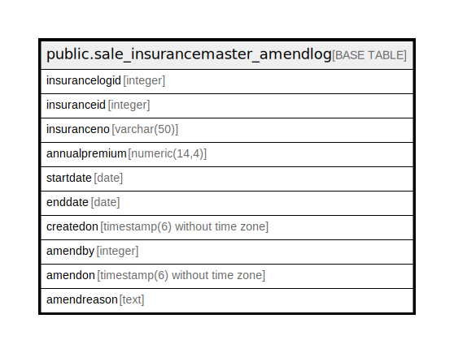

# public.sale_insurancemaster_amendlog

## Description

## Columns

| Name | Type | Default | Nullable | Children | Parents | Comment |
| ---- | ---- | ------- | -------- | -------- | ------- | ------- |
| insurancelogid | integer | nextval('sale_insurancemaster_amendlog_insurancelogid_seq'::regclass) | false |  |  |  |
| insuranceid | integer |  | true |  |  |  |
| insuranceno | varchar(50) |  | true |  |  |  |
| annualpremium | numeric(14,4) |  | true |  |  |  |
| startdate | date |  | true |  |  |  |
| enddate | date |  | true |  |  |  |
| createdon | timestamp(6) without time zone | now() | true |  |  |  |
| amendby | integer |  | true |  |  |  |
| amendon | timestamp(6) without time zone | NULL::timestamp without time zone | true |  |  |  |
| amendreason | text |  | true |  |  |  |

## Constraints

| Name | Type | Definition |
| ---- | ---- | ---------- |
| sale_insurancemaster_amendlog_pkey | PRIMARY KEY | PRIMARY KEY (insurancelogid) |

## Indexes

| Name | Definition |
| ---- | ---------- |
| sale_insurancemaster_amendlog_pkey | CREATE UNIQUE INDEX sale_insurancemaster_amendlog_pkey ON public.sale_insurancemaster_amendlog USING btree (insurancelogid) |

## Relations

---

> Generated by [tbls](https://github.com/k1LoW/tbls)
