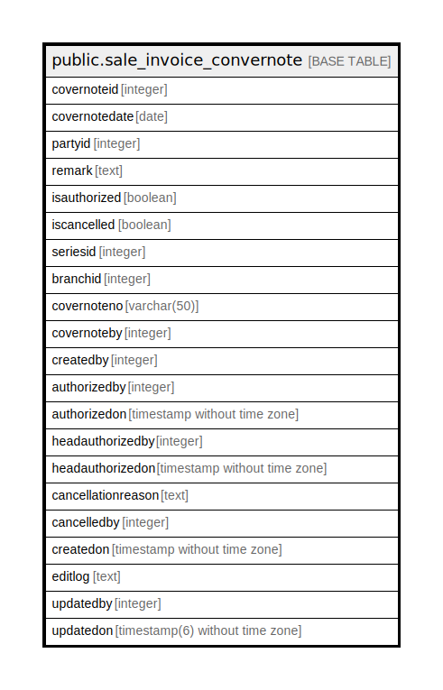

# public.sale_invoice_convernote

## Description

## Columns

| Name | Type | Default | Nullable | Children | Parents | Comment |
| ---- | ---- | ------- | -------- | -------- | ------- | ------- |
| covernoteid | integer | nextval('sale_invoice_convernote_covernoteid_seq'::regclass) | false |  |  |  |
| covernotedate | date |  | true |  |  |  |
| partyid | integer |  | true |  |  |  |
| remark | text |  | true |  |  |  |
| isauthorized | boolean |  | true |  |  |  |
| iscancelled | boolean |  | true |  |  |  |
| seriesid | integer |  | true |  |  |  |
| branchid | integer |  | true |  |  |  |
| covernoteno | varchar(50) | NULL::character varying | true |  |  |  |
| covernoteby | integer |  | true |  |  |  |
| createdby | integer |  | true |  |  |  |
| authorizedby | integer |  | true |  |  |  |
| authorizedon | timestamp without time zone |  | true |  |  |  |
| headauthorizedby | integer |  | true |  |  |  |
| headauthorizedon | timestamp without time zone |  | true |  |  |  |
| cancellationreason | text |  | true |  |  |  |
| cancelledby | integer |  | true |  |  |  |
| createdon | timestamp without time zone | now() | true |  |  |  |
| editlog | text |  | true |  |  |  |
| updatedby | integer |  | true |  |  |  |
| updatedon | timestamp(6) without time zone | NULL::timestamp without time zone | true |  |  |  |

## Constraints

| Name | Type | Definition |
| ---- | ---- | ---------- |
| sale_invoice_convernote_pkey | PRIMARY KEY | PRIMARY KEY (covernoteid) |

## Indexes

| Name | Definition |
| ---- | ---------- |
| sale_invoice_convernote_pkey | CREATE UNIQUE INDEX sale_invoice_convernote_pkey ON public.sale_invoice_convernote USING btree (covernoteid) |

## Relations

---

> Generated by [tbls](https://github.com/k1LoW/tbls)
