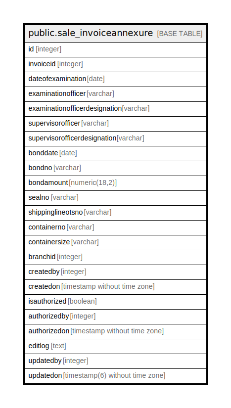

# public.sale_invoiceannexure

## Description

## Columns

| Name | Type | Default | Nullable | Children | Parents | Comment |
| ---- | ---- | ------- | -------- | -------- | ------- | ------- |
| id | integer | nextval('sale_invoiceannexure_id_seq'::regclass) | false |  |  |  |
| invoiceid | integer |  | true |  |  |  |
| dateofexamination | date |  | true |  |  |  |
| examinationofficer | varchar |  | true |  |  |  |
| examinationofficerdesignation | varchar |  | true |  |  |  |
| supervisorofficer | varchar |  | true |  |  |  |
| supervisorofficerdesignation | varchar |  | true |  |  |  |
| bonddate | date |  | true |  |  |  |
| bondno | varchar |  | true |  |  |  |
| bondamount | numeric(18,2) |  | true |  |  |  |
| sealno | varchar |  | true |  |  |  |
| shippinglineotsno | varchar |  | true |  |  |  |
| containerno | varchar |  | true |  |  |  |
| containersize | varchar |  | true |  |  |  |
| branchid | integer |  | true |  |  |  |
| createdby | integer |  | true |  |  |  |
| createdon | timestamp without time zone | now() | true |  |  |  |
| isauthorized | boolean | false | false |  |  |  |
| authorizedby | integer |  | true |  |  |  |
| authorizedon | timestamp without time zone |  | true |  |  |  |
| editlog | text |  | true |  |  |  |
| updatedby | integer |  | true |  |  |  |
| updatedon | timestamp(6) without time zone | NULL::timestamp without time zone | true |  |  |  |

## Constraints

| Name | Type | Definition |
| ---- | ---- | ---------- |
| sale_invoiceannexure_pkey | PRIMARY KEY | PRIMARY KEY (id) |

## Indexes

| Name | Definition |
| ---- | ---------- |
| sale_invoiceannexure_pkey | CREATE UNIQUE INDEX sale_invoiceannexure_pkey ON public.sale_invoiceannexure USING btree (id) |

## Relations

---

> Generated by [tbls](https://github.com/k1LoW/tbls)
