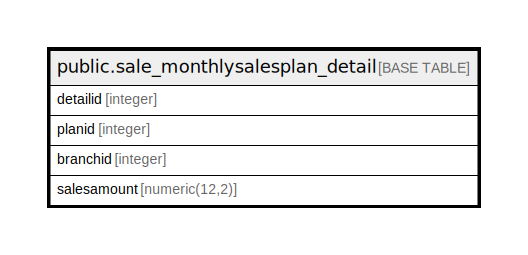

# public.sale_monthlysalesplan_detail

## Description

## Columns

| Name | Type | Default | Nullable | Children | Parents | Comment |
| ---- | ---- | ------- | -------- | -------- | ------- | ------- |
| detailid | integer | nextval('sale_monthlysalesplan_detail_detailid_seq'::regclass) | false |  |  |  |
| planid | integer |  | true |  |  |  |
| branchid | integer |  | true |  |  |  |
| salesamount | numeric(12,2) |  | true |  |  |  |

## Constraints

| Name | Type | Definition |
| ---- | ---- | ---------- |
| sale_monthlysalesplan_detail_pkey | PRIMARY KEY | PRIMARY KEY (detailid) |

## Indexes

| Name | Definition |
| ---- | ---------- |
| sale_monthlysalesplan_detail_pkey | CREATE UNIQUE INDEX sale_monthlysalesplan_detail_pkey ON public.sale_monthlysalesplan_detail USING btree (detailid) |

## Relations

---

> Generated by [tbls](https://github.com/k1LoW/tbls)
