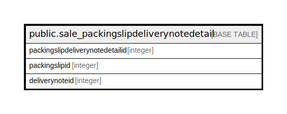

# public.sale_packingslipdeliverynotedetail

## Description

## Columns

| Name | Type | Default | Nullable | Children | Parents | Comment |
| ---- | ---- | ------- | -------- | -------- | ------- | ------- |
| packingslipdeliverynotedetailid | integer | nextval('sale_packingslipdeliverynoted_packingslipdeliverynotedetail_seq'::regclass) | false |  |  |  |
| packingslipid | integer |  | true |  |  |  |
| deliverynoteid | integer |  | true |  |  |  |

## Constraints

| Name | Type | Definition |
| ---- | ---- | ---------- |
| sale_packingslipdeliverynotedetail_pkey | PRIMARY KEY | PRIMARY KEY (packingslipdeliverynotedetailid) |

## Indexes

| Name | Definition |
| ---- | ---------- |
| sale_packingslipdeliverynotedetail_pkey | CREATE UNIQUE INDEX sale_packingslipdeliverynotedetail_pkey ON public.sale_packingslipdeliverynotedetail USING btree (packingslipdeliverynotedetailid) |
| Index_PS_DNDet_PSID | CREATE INDEX "Index_PS_DNDet_PSID" ON public.sale_packingslipdeliverynotedetail USING btree (packingslipid) |

## Relations

---

> Generated by [tbls](https://github.com/k1LoW/tbls)
