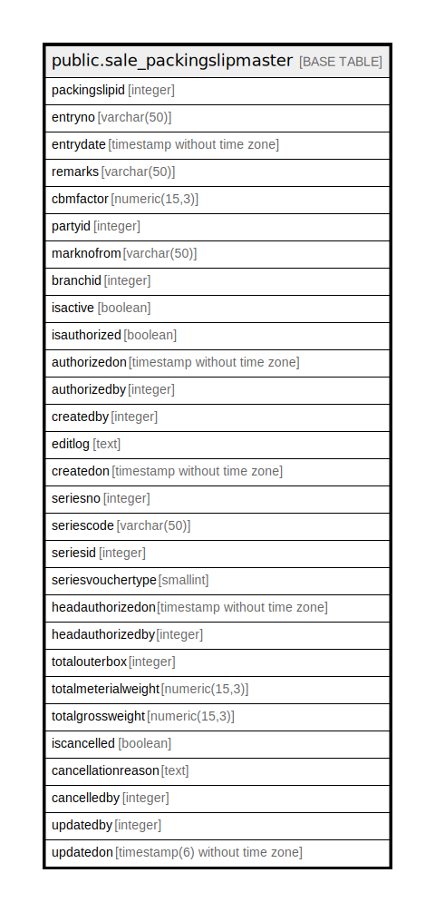

# public.sale_packingslipmaster

## Description

## Columns

| Name | Type | Default | Nullable | Children | Parents | Comment |
| ---- | ---- | ------- | -------- | -------- | ------- | ------- |
| packingslipid | integer | nextval('sale_packingslipmaster_packingslipid_seq'::regclass) | false |  |  |  |
| entryno | varchar(50) |  | true |  |  |  |
| entrydate | timestamp without time zone |  | true |  |  |  |
| remarks | varchar(200) |  | true |  |  |  |
| cbmfactor | numeric(15,3) |  | true |  |  |  |
| partyid | integer |  | true |  |  |  |
| marknofrom | varchar(50) |  | true |  |  |  |
| branchid | integer |  | true |  |  |  |
| isactive | boolean | true | false |  |  |  |
| isauthorized | boolean | false | false |  |  |  |
| authorizedon | timestamp without time zone |  | true |  |  |  |
| authorizedby | integer |  | true |  |  |  |
| createdby | integer |  | true |  |  |  |
| editlog | text |  | true |  |  |  |
| createdon | timestamp without time zone | now() | true |  |  |  |
| seriesno | integer |  | true |  |  |  |
| seriescode | varchar(50) |  | true |  |  |  |
| seriesid | integer |  | true |  |  |  |
| seriesvouchertype | smallint | 0 | true |  |  |  |
| headauthorizedon | timestamp without time zone |  | true |  |  |  |
| headauthorizedby | integer |  | true |  |  |  |
| totalouterbox | integer | 0 | true |  |  |  |
| totalmeterialweight | numeric(15,3) | 0 | true |  |  |  |
| totalgrossweight | numeric(15,3) | 0 | true |  |  |  |
| iscancelled | boolean | false | true |  |  |  |
| cancellationreason | text |  | true |  |  |  |
| cancelledby | integer |  | true |  |  |  |
| updatedby | integer |  | true |  |  |  |
| updatedon | timestamp(6) without time zone | NULL::timestamp without time zone | true |  |  |  |

## Constraints

| Name | Type | Definition |
| ---- | ---- | ---------- |
| sale_packingslipmaster_pkey | PRIMARY KEY | PRIMARY KEY (packingslipid) |

## Indexes

| Name | Definition |
| ---- | ---------- |
| sale_packingslipmaster_pkey | CREATE UNIQUE INDEX sale_packingslipmaster_pkey ON public.sale_packingslipmaster USING btree (packingslipid) |

## Relations

---

> Generated by [tbls](https://github.com/k1LoW/tbls)
