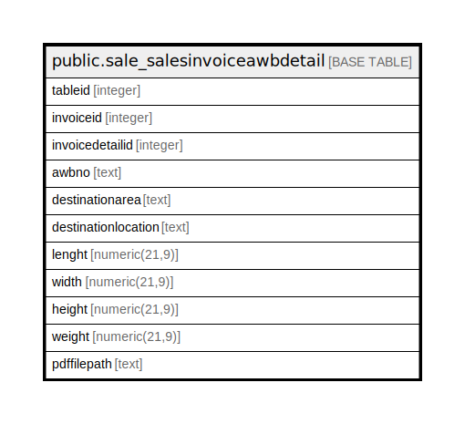

# public.sale_salesinvoiceawbdetail

## Description

## Columns

| Name | Type | Default | Nullable | Children | Parents | Comment |
| ---- | ---- | ------- | -------- | -------- | ------- | ------- |
| tableid | integer | nextval('sale_salesinvoiceawbdetail_tableid_seq'::regclass) | false |  |  |  |
| invoiceid | integer |  | true |  |  |  |
| invoicedetailid | integer |  | true |  |  |  |
| awbno | text |  | true |  |  |  |
| destinationarea | text |  | true |  |  |  |
| destinationlocation | text |  | true |  |  |  |
| lenght | numeric(21,9) |  | true |  |  |  |
| width | numeric(21,9) |  | true |  |  |  |
| height | numeric(21,9) |  | true |  |  |  |
| weight | numeric(21,9) |  | true |  |  |  |
| pdffilepath | text |  | true |  |  |  |

## Constraints

| Name | Type | Definition |
| ---- | ---- | ---------- |
| sale_salesinvoiceawbdetail_pkey | PRIMARY KEY | PRIMARY KEY (tableid) |

## Indexes

| Name | Definition |
| ---- | ---------- |
| sale_salesinvoiceawbdetail_pkey | CREATE UNIQUE INDEX sale_salesinvoiceawbdetail_pkey ON public.sale_salesinvoiceawbdetail USING btree (tableid) |

## Relations

---

> Generated by [tbls](https://github.com/k1LoW/tbls)
