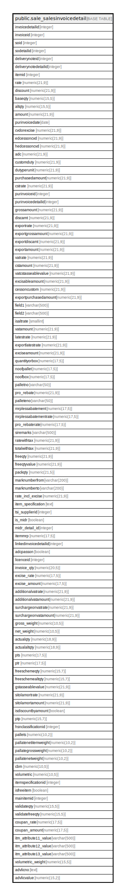

# public.sale_salesinvoicedetail

## Description

## Columns

| Name | Type | Default | Nullable | Children | Parents | Comment |
| ---- | ---- | ------- | -------- | -------- | ------- | ------- |
| invoicedetailid | integer | nextval('sale_salesinvoicedetail_invoicedetailid_seq'::regclass) | false |  |  |  |
| invoiceid | integer |  | true |  |  |  |
| soid | integer |  | true |  |  |  |
| sodetailid | integer |  | true |  |  |  |
| deliverynoteid | integer |  | true |  |  |  |
| deliverynotedetailid | integer |  | true |  |  |  |
| itemid | integer |  | true |  |  |  |
| rate | numeric(21,9) | NULL::numeric | true |  |  |  |
| discount | numeric(21,9) | NULL::numeric | true |  |  |  |
| baseqty | numeric(15,5) | NULL::numeric | true |  |  |  |
| altqty | numeric(15,5) | NULL::numeric | true |  |  |  |
| amount | numeric(21,9) | NULL::numeric | true |  |  |  |
| purinvoicedate | date |  | true |  |  |  |
| cvdorexcise | numeric(21,9) | NULL::numeric | true |  |  |  |
| edcessoncvd | numeric(21,9) | NULL::numeric | true |  |  |  |
| hedcessoncvd | numeric(21,9) | NULL::numeric | true |  |  |  |
| adc | numeric(21,9) | NULL::numeric | true |  |  |  |
| customduty | numeric(21,9) | NULL::numeric | true |  |  |  |
| dutyperunit | numeric(21,9) | NULL::numeric | true |  |  |  |
| purchasedamount | numeric(21,9) | NULL::numeric | true |  |  |  |
| cstrate | numeric(21,9) | NULL::numeric | true |  |  |  |
| purinvoiceid | integer |  | true |  |  |  |
| purinvoicedetailid | integer |  | true |  |  |  |
| grossamount | numeric(21,9) | NULL::numeric | true |  |  |  |
| discamt | numeric(21,9) | NULL::numeric | true |  |  |  |
| exportrate | numeric(21,9) | NULL::numeric | true |  |  |  |
| exportgrossamount | numeric(21,9) | NULL::numeric | true |  |  |  |
| exportdiscamt | numeric(21,9) | NULL::numeric | true |  |  |  |
| exportamount | numeric(21,9) | NULL::numeric | true |  |  |  |
| vatrate | numeric(21,9) | NULL::numeric | true |  |  |  |
| cstamount | numeric(21,9) | NULL::numeric | true |  |  |  |
| vatcstasseablevalue | numeric(21,9) | NULL::numeric | true |  |  |  |
| excisableamount | numeric(21,9) | NULL::numeric | true |  |  |  |
| cessoncustom | numeric(21,9) | NULL::numeric | true |  |  |  |
| exportpurchasedamount | numeric(21,9) | NULL::numeric | true |  |  |  |
| isaltrate | smallint |  | true |  |  |  |
| field1 | varchar(500) |  | true |  |  |  |
| field2 | varchar(500) |  | true |  |  |  |
| vatamount | numeric(21,9) | 0 | true |  |  |  |
| exciseamount | numeric(21,9) | 0 | true |  |  |  |
| quantityorbox | numeric(17,5) | 0 | true |  |  |  |
| noofpallet | numeric(17,5) | 0 | true |  |  |  |
| noofbox | numeric(17,5) | 0 | true |  |  |  |
| palletno | varchar(50) |  | true |  |  |  |
| palleteno | varchar(50) |  | true |  |  |  |
| latestrate | numeric(21,9) |  | true |  |  |  |
| exportlatestrate | numeric(21,9) |  | true |  |  |  |
| pro_rebate | numeric(21,9) | 0.0 | true |  |  |  |
| mrplessabatement | numeric(17,5) | 0 | true |  |  |  |
| mrplessabatementrate | numeric(17,5) | 0 | true |  |  |  |
| pro_rebaterate | numeric(17,5) | 0 | true |  |  |  |
| siremarks | varchar(500) |  | true |  |  |  |
| ratewithtax | numeric(21,9) | 0 | true |  |  |  |
| totalwithtax | numeric(21,9) | 0 | true |  |  |  |
| freeqty | numeric(21,9) | 0 | true |  |  |  |
| freeqtyvalue | numeric(21,9) | 0 | true |  |  |  |
| packqty | numeric(21,5) | 0 | true |  |  |  |
| marknumberfrom | varchar(200) |  | true |  |  |  |
| marknumberto | varchar(200) |  | true |  |  |  |
| rate_incl_excise | numeric(21,9) |  | true |  |  |  |
| item_specification | text |  | true |  |  |  |
| tsi_supplierid | integer |  | true |  |  |  |
| is_midr | boolean |  | true |  |  |  |
| midr_detail_id | integer |  | true |  |  |  |
| itemmrp | numeric(17,5) |  | true |  |  |  |
| linkedinvoicedetailid | integer |  | true |  |  |  |
| adcpasson | boolean | true | true |  |  |  |
| licenceid | integer |  | true |  |  |  |
| invoice_qty | numeric(20,5) |  | true |  |  |  |
| excise_rate | numeric(17,5) | NULL::numeric | true |  |  | For Item Excise Ledger |
| excise_amount | numeric(17,5) | NULL::numeric | true |  |  | For Item Excise Ledger |
| additionalvatrate | numeric(21,9) | 0 | true |  |  |  |
| additionalvatamount | numeric(21,9) | 0 | true |  |  |  |
| surchargeonvatrate | numeric(21,9) | 0 | true |  |  |  |
| surchargeonvatamount | numeric(21,9) | 0 | true |  |  |  |
| gross_weight | numeric(10,5) |  | true |  |  |  |
| net_weight | numeric(10,5) |  | true |  |  |  |
| actualqty | numeric(18,9) |  | true |  |  |  |
| actualaltqty | numeric(18,9) |  | true |  |  |  |
| pts | numeric(17,5) |  | true |  |  |  |
| ptr | numeric(17,5) |  | true |  |  |  |
| freeschemeqty | numeric(15,7) |  | true |  |  |  |
| freeschemealtqty | numeric(15,7) |  | true |  |  |  |
| gstasseablevalue | numeric(21,9) |  | true |  |  |  |
| sitolamortrate | numeric(21,9) | 0 | true |  |  |  |
| sitolamortamount | numeric(21,9) | 0 | true |  |  |  |
| isdiscountbyamount | boolean | false | true |  |  |  |
| ptp | numeric(15,7) |  | true |  |  |  |
| hsnclassificationid | integer |  | true |  |  |  |
| pallets | numeric(10,2) |  | true |  |  |  |
| pallatenetitemweight | numeric(10,2) |  | true |  |  |  |
| pallategrossweight | numeric(10,2) |  | true |  |  |  |
| pallatenetweight | numeric(10,2) |  | true |  |  |  |
| cbm | numeric(10,5) |  | true |  |  |  |
| volumetric | numeric(10,5) |  | true |  |  |  |
| itemspecificationid | integer |  | true |  |  |  |
| isfreeitem | boolean | false | true |  |  |  |
| mainitemid | integer |  | true |  |  |  |
| validateqty | numeric(15,5) |  | true |  |  |  |
| validatefreeqty | numeric(15,5) |  | true |  |  |  |
| coupan_rate | numeric(17,5) | 0 | true |  |  |  |
| coupan_amount | numeric(17,5) | 0 | true |  |  |  |
| itm_attribute11_value | varchar(500) | ''::character varying | true |  |  |  |
| itm_attribute12_value | varchar(500) | ''::character varying | true |  |  |  |
| itm_attribute13_value | varchar(500) | ''::character varying | true |  |  |  |
| volumetric_weight | numeric(15,5) | 0 | true |  |  |  |
| advlicno | text |  | true |  |  |  |
| advlicvalue | numeric(15,2) |  | true |  |  |  |

## Constraints

| Name | Type | Definition |
| ---- | ---- | ---------- |
| sale_salesinvoicedetail_pkey | PRIMARY KEY | PRIMARY KEY (invoicedetailid) |

## Indexes

| Name | Definition |
| ---- | ---------- |
| sale_salesinvoicedetail_pkey | CREATE UNIQUE INDEX sale_salesinvoicedetail_pkey ON public.sale_salesinvoicedetail USING btree (invoicedetailid) |
| Index_SI_Det_SIID | CREATE INDEX "Index_SI_Det_SIID" ON public.sale_salesinvoicedetail USING btree (invoiceid) |

## Relations

---

> Generated by [tbls](https://github.com/k1LoW/tbls)
