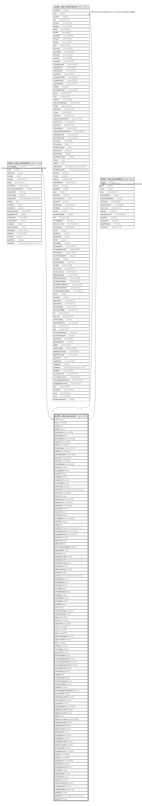

# public.sale_salesorder

## Description

## Columns

| Name | Type | Default | Nullable | Children | Parents | Comment |
| ---- | ---- | ------- | -------- | -------- | ------- | ------- |
| soid | integer | nextval('sale_salesorder_soid_seq'::regclass) | false | [public.sale_soduedetail](public.sale_soduedetail.md) [public.sale_soitemdetail](public.sale_soitemdetail.md) [public.sale_sotaxdetail](public.sale_sotaxdetail.md) |  |  |
| sono | varchar(25) |  | true |  |  |  |
| sodate | date |  | true |  |  |  |
| partyid | integer |  | true |  |  |  |
| dispatchdocno | varchar(30) |  | true |  |  |  |
| dispatchdate | date |  | true |  |  |  |
| termsofpayment | varchar(100) |  | true |  |  |  |
| supplierref | varchar(30) |  | true |  |  |  |
| otherref | varchar(30) |  | true |  |  |  |
| freightcharges | numeric(21,9) |  | true |  |  |  |
| vatformno | varchar(20) |  | true |  |  |  |
| nameoftransporter | varchar(50) |  | true |  |  |  |
| destination | varchar(100) |  | true |  |  |  |
| stpermitno | varchar(20) |  | true |  |  |  |
| modeoftransport | varchar(20) |  | true |  |  |  |
| isopenso | boolean |  | true |  |  |  |
| taxtemplateid | integer |  | true |  |  |  |
| branchid | integer |  | true |  |  |  |
| createdby | integer |  | false |  |  |  |
| isauthorized | boolean | false | false |  |  |  |
| iscancelled | boolean | false | false |  |  |  |
| authorizedby | integer |  | true |  |  |  |
| authorizedon | timestamp without time zone |  | true |  |  |  |
| seriescode | varchar(50) |  | true |  |  |  |
| seriesno | integer |  | true |  |  |  |
| grossamount | numeric(21,9) |  | true |  |  |  |
| totalamount | numeric(21,9) |  | true |  |  |  |
| partyorderno | varchar(75) |  | true |  |  |  |
| quotationid | integer |  | true |  |  |  |
| isclosed | boolean | false | false |  |  |  |
| currencyid | integer |  | true |  |  |  |
| exchangerate | numeric(20,10) | NULL::numeric | true |  |  |  |
| orderedby | integer |  | true |  |  |  |
| editlog | text |  | true |  |  |  |
| createdon | timestamp without time zone | now() | true |  |  |  |
| exportgrossamount | numeric(21,9) | NULL::numeric | true |  |  |  |
| exporttotalamount | numeric(21,9) | NULL::numeric | true |  |  |  |
| isexportso | boolean | false | true |  |  |  |
| effectivefrom | date |  | true |  |  |  |
| effectiveto | date |  | true |  |  |  |
| termconditiontemplateid | integer |  | true |  |  |  |
| partyorderdate | date |  | true |  |  |  |
| seriesid | integer |  | true |  |  |  |
| headauthorizedby | integer |  | true |  |  |  |
| headauthorizedon | timestamp without time zone |  | true |  |  |  |
| cancellationreason | text |  | true |  |  |  |
| amendreason | text |  | true |  |  |  |
| ordervouchertype | integer |  | true |  |  |  |
| amendby | integer |  | true |  |  |  |
| amendon | timestamp(6) without time zone |  | true |  |  |  |
| billingaddress | text |  | true |  |  |  |
| shippingaddress | text |  | true |  |  |  |
| closereason | text |  | true |  |  |  |
| closingdate | date |  | true |  |  |  |
| cancellationdate | date |  | true |  |  |  |
| closedby | integer |  | true |  |  |  |
| cancelledby | integer |  | true |  |  |  |
| schedulefrom | date |  | true |  |  |  |
| scheduleto | date |  | true |  |  |  |
| srno | integer |  | true |  |  |  |
| seriesvouchertype | smallint | 0 | true |  |  |  |
| unauthorizereason | text |  | true |  |  |  |
| range | varchar(50) |  | true |  |  |  |
| division | varchar(50) |  | true |  |  |  |
| collectorate | varchar(50) |  | true |  |  |  |
| eccno | varchar(50) |  | true |  |  |  |
| lstno | varchar(50) |  | true |  |  |  |
| cstno | varchar(50) |  | true |  |  |  |
| allowmultishipping | boolean | false | true |  |  |  |
| online_created | boolean | false | true |  |  |  |
| title | varchar(50) |  | true |  |  |  |
| ordertype | smallint | 0 | true |  |  | 0 :- Sales Order 1 :- Open Sales Order 2 :- Service Sales Order 3 :- Sales Commitment |
| credit_days | integer | 0 | true |  |  |  |
| sivoucherid | integer |  | true |  |  |  |
| lastmodifieddate | date | now() | true |  |  |  |
| issummarypocreated | boolean | false | true |  |  |  |
| iscommitmentauthorized | boolean | false | true |  |  |  |
| issummarypoauthorized | boolean | false | true |  |  |  |
| issdsauthorized | boolean | false | true |  |  |  |
| issdscreated | boolean | false | true |  |  |  |
| sdsdate | date | ('now'::text)::date | true |  |  |  |
| issdsammendon | date |  | true |  |  |  |
| issdsammendreason | text |  | true |  |  |  |
| issdsammendby | integer | 0 | true |  |  |  |
| updatefrom | integer | 0 | true |  |  | 0-Sales Order 1-Sales Commitment 2-Summary PO 3-Sales Delivery Schedule |
| alloweditingtaxtemplateinsi | boolean | false | true |  |  |  |
| commitmentid | integer |  | true |  |  |  |
| webpurchaseorderid | integer |  | true |  |  |  |
| sales_person_id | integer |  | true |  |  |  |
| isimported | boolean | false | true |  |  |  |
| mobileapporderno | varchar(50) |  | true |  |  |  |
| bargaindocumentid | integer |  | true |  |  |  |
| bargaindocumentno | text |  | true |  |  |  |
| ratetime | text |  | true |  |  |  |
| party_wise_unique_no | varchar(200) | ''::character varying | false |  |  |  |
| shippingcountryid | integer |  | true |  |  |  |
| shippingstateid | integer |  | true |  |  |  |
| billingcountryid | integer |  | true |  |  |  |
| billingstateid | integer |  | true |  |  |  |
| shippinggstinno | varchar |  | true |  |  |  |
| billinggstinno | varchar |  | true |  |  |  |
| billingaddressfrmid | integer |  | true |  |  |  |
| billingcountryidfrm | integer |  | true |  |  |  |
| billingstateidfrm | integer |  | true |  |  |  |
| billinggstinnofrm | varchar(50) |  | true |  |  |  |
| pospoid | varchar(100) |  | true |  |  |  |
| pospono | varchar(100) |  | true |  |  |  |
| shippingname | varchar(200) |  | true |  |  |  |
| rejectedby | integer |  | true |  |  |  |
| headrejectedby | integer |  | true |  |  |  |
| rejectedreason | text |  | true |  |  |  |
| isrejected | boolean | false | true |  |  |  |
| authorizelevel | integer | 0 | true |  |  |  |
| lastupdatedformula | text |  | true |  |  |  |
| authorizationlevelid | integer | 0 | true |  |  |  |
| isinitialrejected | boolean | false | true |  |  |  |
| shipping_address_id | integer | 0 | true |  |  |  |
| updatedby | integer |  | true |  |  |  |
| updatedon | timestamp(6) without time zone | NULL::timestamp without time zone | true |  |  |  |
| partysiteid | integer | 0 | true |  |  |  |

## Constraints

| Name | Type | Definition |
| ---- | ---- | ---------- |
| salesorder_pkey | PRIMARY KEY | PRIMARY KEY (soid) |

## Indexes

| Name | Definition |
| ---- | ---------- |
| salesorder_pkey | CREATE UNIQUE INDEX salesorder_pkey ON public.sale_salesorder USING btree (soid) |
| Index_SO_SOid | CREATE INDEX "Index_SO_SOid" ON public.sale_salesorder USING btree (soid, partyid, branchid) WHERE ((isauthorized = true) AND (iscancelled = false)) |
| ui_salesorder_no | CREATE UNIQUE INDEX ui_salesorder_no ON public.sale_salesorder USING btree (branchid, isopenso, sodate, sono, ordervouchertype) WHERE (sodate > '2018-05-24'::date) |

## Triggers

| Name | Definition |
| ---- | ---------- |
| so_amend_log_entry | CREATE TRIGGER so_amend_log_entry BEFORE UPDATE ON public.sale_salesorder FOR EACH ROW EXECUTE FUNCTION so_amend_log_entry() |

## Relations

---

> Generated by [tbls](https://github.com/k1LoW/tbls)
