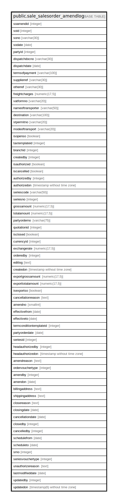

# public.sale_salesorder_amendlog

## Description

## Columns

| Name | Type | Default | Nullable | Children | Parents | Comment |
| ---- | ---- | ------- | -------- | -------- | ------- | ------- |
| soamendid | integer | nextval('sale_salesorder_amendlog_soamendid_seq'::regclass) | false |  |  |  |
| soid | integer |  | false |  |  |  |
| sono | varchar(30) |  | true |  |  |  |
| sodate | date |  | true |  |  |  |
| partyid | integer |  | true |  |  |  |
| dispatchdocno | varchar(30) |  | true |  |  |  |
| dispatchdate | date |  | true |  |  |  |
| termsofpayment | varchar(100) |  | true |  |  |  |
| supplierref | varchar(30) |  | true |  |  |  |
| otherref | varchar(30) |  | true |  |  |  |
| freightcharges | numeric(17,5) |  | true |  |  |  |
| vatformno | varchar(20) |  | true |  |  |  |
| nameoftransporter | varchar(50) |  | true |  |  |  |
| destination | varchar(100) |  | true |  |  |  |
| stpermitno | varchar(20) |  | true |  |  |  |
| modeoftransport | varchar(20) |  | true |  |  |  |
| isopenso | boolean |  | true |  |  |  |
| taxtemplateid | integer |  | true |  |  |  |
| branchid | integer |  | true |  |  |  |
| createdby | integer |  | false |  |  |  |
| isauthorized | boolean | false | false |  |  |  |
| iscancelled | boolean | false | false |  |  |  |
| authorizedby | integer |  | true |  |  |  |
| authorizedon | timestamp without time zone |  | true |  |  |  |
| seriescode | varchar(50) |  | true |  |  |  |
| seriesno | integer |  | true |  |  |  |
| grossamount | numeric(17,5) |  | true |  |  |  |
| totalamount | numeric(17,5) |  | true |  |  |  |
| partyorderno | varchar(75) |  | true |  |  |  |
| quotationid | integer |  | true |  |  |  |
| isclosed | boolean | false | false |  |  |  |
| currencyid | integer |  | true |  |  |  |
| exchangerate | numeric(17,5) | NULL::numeric | true |  |  |  |
| orderedby | integer |  | true |  |  |  |
| editlog | text |  | true |  |  |  |
| createdon | timestamp without time zone | now() | true |  |  |  |
| exportgrossamount | numeric(17,5) | NULL::numeric | true |  |  |  |
| exporttotalamount | numeric(17,5) | NULL::numeric | true |  |  |  |
| isexportso | boolean | false | true |  |  |  |
| cancellationreason | text |  | true |  |  |  |
| amendno | smallint |  | true |  |  |  |
| effectivefrom | date |  | true |  |  |  |
| effectiveto | date |  | true |  |  |  |
| termconditiontemplateid | integer |  | true |  |  |  |
| partyorderdate | date |  | true |  |  |  |
| seriesid | integer |  | true |  |  |  |
| headauthorizedby | integer |  | true |  |  |  |
| headauthorizedon | timestamp without time zone |  | true |  |  |  |
| amendreason | text |  | true |  |  |  |
| ordervouchertype | integer |  | true |  |  |  |
| amendby | integer |  | true |  |  |  |
| amendon | date |  | true |  |  |  |
| billingaddress | text |  | true |  |  |  |
| shippingaddress | text |  | true |  |  |  |
| closereason | text |  | true |  |  |  |
| closingdate | date |  | true |  |  |  |
| cancellationdate | date |  | true |  |  |  |
| closedby | integer |  | true |  |  |  |
| cancelledby | integer |  | true |  |  |  |
| schedulefrom | date |  | true |  |  |  |
| scheduleto | date |  | true |  |  |  |
| srno | integer |  | true |  |  |  |
| seriesvouchertype | integer |  | true |  |  |  |
| unauthorizereason | text |  | true |  |  |  |
| lastmodifieddate | date | now() | true |  |  |  |
| updatedby | integer |  | true |  |  |  |
| updatedon | timestamp(6) without time zone | NULL::timestamp without time zone | true |  |  |  |

## Constraints

| Name | Type | Definition |
| ---- | ---- | ---------- |
| sale_salesorder_amendlog_pkey | PRIMARY KEY | PRIMARY KEY (soamendid) |

## Indexes

| Name | Definition |
| ---- | ---------- |
| sale_salesorder_amendlog_pkey | CREATE UNIQUE INDEX sale_salesorder_amendlog_pkey ON public.sale_salesorder_amendlog USING btree (soamendid) |

## Relations

---

> Generated by [tbls](https://github.com/k1LoW/tbls)
