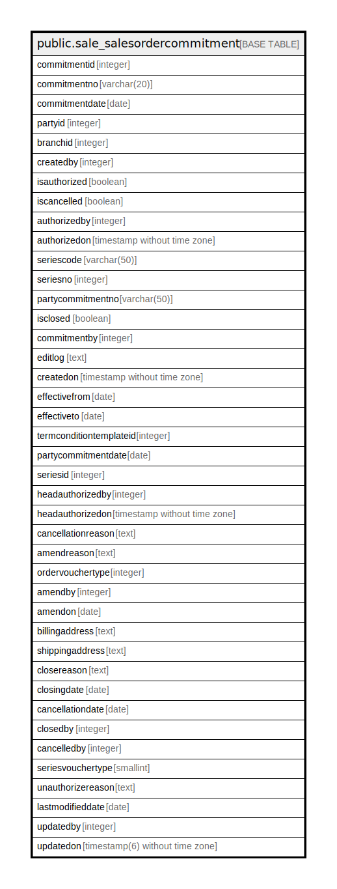

# public.sale_salesordercommitment

## Description

## Columns

| Name | Type | Default | Nullable | Children | Parents | Comment |
| ---- | ---- | ------- | -------- | -------- | ------- | ------- |
| commitmentid | integer | nextval('sale_salesordercommitment_commitmentid_seq'::regclass) | false |  |  |  |
| commitmentno | varchar(20) |  | true |  |  |  |
| commitmentdate | date |  | true |  |  |  |
| partyid | integer |  | true |  |  |  |
| branchid | integer |  | true |  |  |  |
| createdby | integer |  | false |  |  |  |
| isauthorized | boolean | false | false |  |  |  |
| iscancelled | boolean | false | false |  |  |  |
| authorizedby | integer |  | true |  |  |  |
| authorizedon | timestamp without time zone |  | true |  |  |  |
| seriescode | varchar(50) |  | true |  |  |  |
| seriesno | integer |  | true |  |  |  |
| partycommitmentno | varchar(50) |  | true |  |  |  |
| isclosed | boolean | false | false |  |  |  |
| commitmentby | integer |  | true |  |  |  |
| editlog | text |  | true |  |  |  |
| createdon | timestamp without time zone | now() | true |  |  |  |
| effectivefrom | date |  | true |  |  |  |
| effectiveto | date |  | true |  |  |  |
| termconditiontemplateid | integer |  | true |  |  |  |
| partycommitmentdate | date |  | true |  |  |  |
| seriesid | integer |  | true |  |  |  |
| headauthorizedby | integer |  | true |  |  |  |
| headauthorizedon | timestamp without time zone |  | true |  |  |  |
| cancellationreason | text |  | true |  |  |  |
| amendreason | text |  | true |  |  |  |
| ordervouchertype | integer |  | true |  |  |  |
| amendby | integer |  | true |  |  |  |
| amendon | date |  | true |  |  |  |
| billingaddress | text |  | true |  |  |  |
| shippingaddress | text |  | true |  |  |  |
| closereason | text |  | true |  |  |  |
| closingdate | date |  | true |  |  |  |
| cancellationdate | date |  | true |  |  |  |
| closedby | integer |  | true |  |  |  |
| cancelledby | integer |  | true |  |  |  |
| seriesvouchertype | smallint | 0 | true |  |  |  |
| unauthorizereason | text |  | true |  |  |  |
| lastmodifieddate | date | now() | true |  |  |  |
| updatedby | integer |  | true |  |  |  |
| updatedon | timestamp(6) without time zone | NULL::timestamp without time zone | true |  |  |  |

## Constraints

| Name | Type | Definition |
| ---- | ---- | ---------- |
| sale_salesordercommitment_pkey | PRIMARY KEY | PRIMARY KEY (commitmentid) |

## Indexes

| Name | Definition |
| ---- | ---------- |
| sale_salesordercommitment_pkey | CREATE UNIQUE INDEX sale_salesordercommitment_pkey ON public.sale_salesordercommitment USING btree (commitmentid) |

## Relations

---

> Generated by [tbls](https://github.com/k1LoW/tbls)
