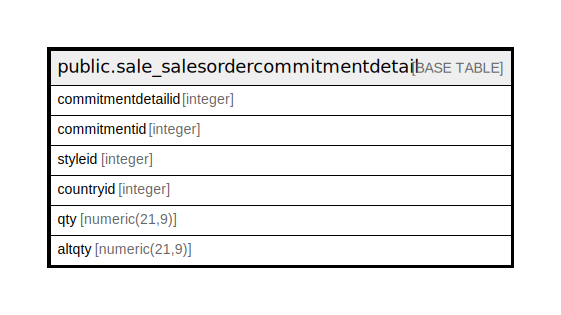

# public.sale_salesordercommitmentdetail

## Description

## Columns

| Name | Type | Default | Nullable | Children | Parents | Comment |
| ---- | ---- | ------- | -------- | -------- | ------- | ------- |
| commitmentdetailid | integer | nextval('sale_salesordercommitmentdetail_commitmentid_seq'::regclass) | false |  |  |  |
| commitmentid | integer |  | true |  |  |  |
| styleid | integer |  | true |  |  |  |
| countryid | integer |  | true |  |  |  |
| qty | numeric(21,9) |  | true |  |  |  |
| altqty | numeric(21,9) |  | true |  |  |  |

## Constraints

| Name | Type | Definition |
| ---- | ---- | ---------- |
| sale_salesordercommitmentdetail_pkey | PRIMARY KEY | PRIMARY KEY (commitmentdetailid) |

## Indexes

| Name | Definition |
| ---- | ---------- |
| sale_salesordercommitmentdetail_pkey | CREATE UNIQUE INDEX sale_salesordercommitmentdetail_pkey ON public.sale_salesordercommitmentdetail USING btree (commitmentdetailid) |

## Relations

---

> Generated by [tbls](https://github.com/k1LoW/tbls)
