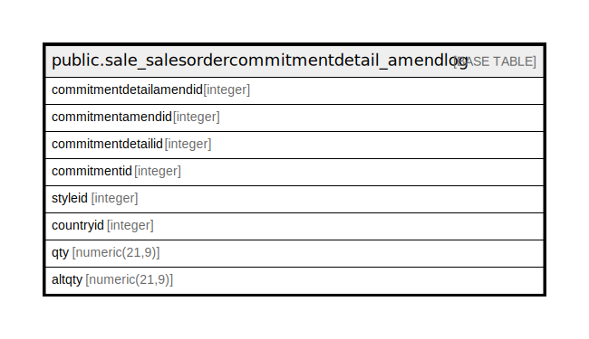

# public.sale_salesordercommitmentdetail_amendlog

## Description

## Columns

| Name | Type | Default | Nullable | Children | Parents | Comment |
| ---- | ---- | ------- | -------- | -------- | ------- | ------- |
| commitmentdetailamendid | integer | nextval('sale_salesordercommitmentdetail_ame_commitmentdetailamendid_seq'::regclass) | false |  |  |  |
| commitmentamendid | integer |  | true |  |  |  |
| commitmentdetailid | integer |  | true |  |  |  |
| commitmentid | integer |  | true |  |  |  |
| styleid | integer |  | true |  |  |  |
| countryid | integer |  | true |  |  |  |
| qty | numeric(21,9) |  | true |  |  |  |
| altqty | numeric(21,9) |  | true |  |  |  |

## Constraints

| Name | Type | Definition |
| ---- | ---- | ---------- |
| sale_salesordercommitmentdetail_amendlog_pkey | PRIMARY KEY | PRIMARY KEY (commitmentdetailamendid) |

## Indexes

| Name | Definition |
| ---- | ---------- |
| sale_salesordercommitmentdetail_amendlog_pkey | CREATE UNIQUE INDEX sale_salesordercommitmentdetail_amendlog_pkey ON public.sale_salesordercommitmentdetail_amendlog USING btree (commitmentdetailamendid) |

## Relations

---

> Generated by [tbls](https://github.com/k1LoW/tbls)
