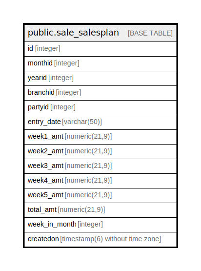

# public.sale_salesplan

## Description

## Columns

| Name | Type | Default | Nullable | Children | Parents | Comment |
| ---- | ---- | ------- | -------- | -------- | ------- | ------- |
| id | integer | nextval('sale_salesplan_id_seq'::regclass) | false |  |  |  |
| monthid | integer |  | true |  |  |  |
| yearid | integer |  | true |  |  |  |
| branchid | integer |  | true |  |  |  |
| partyid | integer |  | true |  |  |  |
| entry_date | varchar(50) |  | true |  |  |  |
| week1_amt | numeric(21,9) | NULL::numeric | true |  |  |  |
| week2_amt | numeric(21,9) | NULL::numeric | true |  |  |  |
| week3_amt | numeric(21,9) | NULL::numeric | true |  |  |  |
| week4_amt | numeric(21,9) | NULL::numeric | true |  |  |  |
| week5_amt | numeric(21,9) | NULL::numeric | true |  |  |  |
| total_amt | numeric(21,9) | NULL::numeric | true |  |  |  |
| week_in_month | integer |  | true |  |  |  |
| createdon | timestamp(6) without time zone | now() | true |  |  |  |

## Constraints

| Name | Type | Definition |
| ---- | ---- | ---------- |
| sale_salesplan_pkey | PRIMARY KEY | PRIMARY KEY (id) |

## Indexes

| Name | Definition |
| ---- | ---------- |
| sale_salesplan_pkey | CREATE UNIQUE INDEX sale_salesplan_pkey ON public.sale_salesplan USING btree (id) |

## Relations

---

> Generated by [tbls](https://github.com/k1LoW/tbls)
