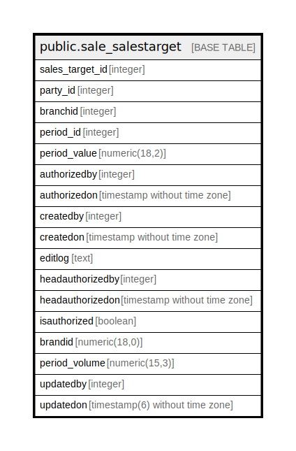

# public.sale_salestarget

## Description

## Columns

| Name | Type | Default | Nullable | Children | Parents | Comment |
| ---- | ---- | ------- | -------- | -------- | ------- | ------- |
| sales_target_id | integer | nextval('sale_salestarget_sales_target_id_seq'::regclass) | false |  |  |  |
| party_id | integer |  | true |  |  |  |
| branchid | integer |  | true |  |  |  |
| period_id | integer |  | true |  |  |  |
| period_value | numeric(18,2) |  | true |  |  |  |
| authorizedby | integer |  | true |  |  |  |
| authorizedon | timestamp without time zone |  | true |  |  |  |
| createdby | integer |  | true |  |  |  |
| createdon | timestamp without time zone | now() | true |  |  |  |
| editlog | text |  | true |  |  |  |
| headauthorizedby | integer |  | true |  |  |  |
| headauthorizedon | timestamp without time zone |  | true |  |  |  |
| isauthorized | boolean |  | true |  |  |  |
| brandid | numeric(18,0) | 0 | true |  |  |  |
| period_volume | numeric(15,3) | 0 | false |  |  |  |
| updatedby | integer |  | true |  |  |  |
| updatedon | timestamp(6) without time zone | NULL::timestamp without time zone | true |  |  |  |

## Constraints

| Name | Type | Definition |
| ---- | ---- | ---------- |
| sale_salestarget_pkey | PRIMARY KEY | PRIMARY KEY (sales_target_id) |

## Indexes

| Name | Definition |
| ---- | ---------- |
| sale_salestarget_pkey | CREATE UNIQUE INDEX sale_salestarget_pkey ON public.sale_salestarget USING btree (sales_target_id) |

## Relations

---

> Generated by [tbls](https://github.com/k1LoW/tbls)
