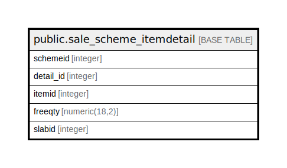

# public.sale_scheme_itemdetail

## Description

## Columns

| Name | Type | Default | Nullable | Children | Parents | Comment |
| ---- | ---- | ------- | -------- | -------- | ------- | ------- |
| schemeid | integer | nextval('sale_scheme_itemdetail_schemeid_seq'::regclass) | false |  |  |  |
| detail_id | integer |  | true |  |  |  |
| itemid | integer |  | true |  |  |  |
| freeqty | numeric(18,2) |  | true |  |  |  |
| slabid | integer |  | true |  |  |  |

## Constraints

| Name | Type | Definition |
| ---- | ---- | ---------- |
| sale_scheme_itemdetail_pkey | PRIMARY KEY | PRIMARY KEY (schemeid) |

## Indexes

| Name | Definition |
| ---- | ---------- |
| sale_scheme_itemdetail_pkey | CREATE UNIQUE INDEX sale_scheme_itemdetail_pkey ON public.sale_scheme_itemdetail USING btree (schemeid) |

## Relations

---

> Generated by [tbls](https://github.com/k1LoW/tbls)
