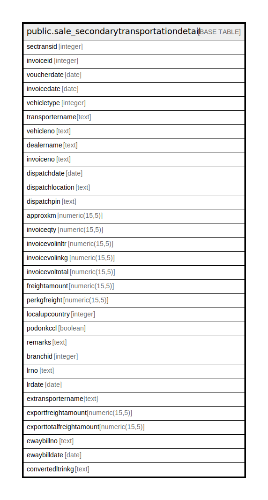

# public.sale_secondarytransportationdetail

## Description

## Columns

| Name | Type | Default | Nullable | Children | Parents | Comment |
| ---- | ---- | ------- | -------- | -------- | ------- | ------- |
| sectransid | integer | nextval('sale_secondarytransportationdetail_sectransid_seq'::regclass) | false |  |  |  |
| invoiceid | integer |  | true |  |  |  |
| voucherdate | date |  | true |  |  |  |
| invoicedate | date |  | true |  |  |  |
| vehicletype | integer |  | true |  |  |  |
| transportername | text |  | true |  |  |  |
| vehicleno | text |  | true |  |  |  |
| dealername | text |  | true |  |  |  |
| invoiceno | text |  | true |  |  |  |
| dispatchdate | date |  | true |  |  |  |
| dispatchlocation | text |  | true |  |  |  |
| dispatchpin | text |  | true |  |  |  |
| approxkm | numeric(15,5) |  | true |  |  |  |
| invoiceqty | numeric(15,5) |  | true |  |  |  |
| invoicevolinltr | numeric(15,5) |  | true |  |  |  |
| invoicevolinkg | numeric(15,5) |  | true |  |  |  |
| invoicevoltotal | numeric(15,5) |  | true |  |  |  |
| freightamount | numeric(15,5) |  | true |  |  |  |
| perkgfreight | numeric(15,5) |  | true |  |  |  |
| localupcountry | integer |  | true |  |  |  |
| podonkccl | boolean | false | true |  |  |  |
| remarks | text |  | true |  |  |  |
| branchid | integer |  | true |  |  |  |
| lrno | text |  | true |  |  |  |
| lrdate | date |  | true |  |  |  |
| extransportername | text |  | true |  |  |  |
| exportfreightamount | numeric(15,5) |  | true |  |  |  |
| exporttotalfreightamount | numeric(15,5) |  | true |  |  |  |
| ewaybillno | text |  | true |  |  |  |
| ewaybilldate | date |  | true |  |  |  |
| convertedltrinkg | text |  | true |  |  |  |

## Relations

---

> Generated by [tbls](https://github.com/k1LoW/tbls)
