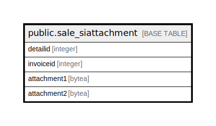

# public.sale_siattachment

## Description

## Columns

| Name | Type | Default | Nullable | Children | Parents | Comment |
| ---- | ---- | ------- | -------- | -------- | ------- | ------- |
| detailid | integer | nextval('sale_siattachment_detailid_seq'::regclass) | false |  |  |  |
| invoiceid | integer |  | true |  |  |  |
| attachment1 | bytea |  | true |  |  |  |
| attachment2 | bytea |  | true |  |  |  |

## Constraints

| Name | Type | Definition |
| ---- | ---- | ---------- |
| sale_siattachment_pkey | PRIMARY KEY | PRIMARY KEY (detailid) |

## Indexes

| Name | Definition |
| ---- | ---------- |
| sale_siattachment_pkey | CREATE UNIQUE INDEX sale_siattachment_pkey ON public.sale_siattachment USING btree (detailid) |

## Relations

---

> Generated by [tbls](https://github.com/k1LoW/tbls)
