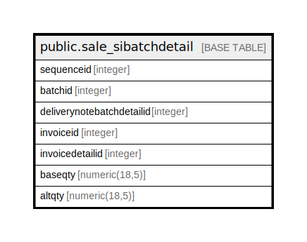

# public.sale_sibatchdetail

## Description

## Columns

| Name | Type | Default | Nullable | Children | Parents | Comment |
| ---- | ---- | ------- | -------- | -------- | ------- | ------- |
| sequenceid | integer | nextval('sale_sibatchdetail_sequenceid_seq'::regclass) | false |  |  |  |
| batchid | integer |  | false |  |  |  |
| deliverynotebatchdetailid | integer |  | false |  |  |  |
| invoiceid | integer |  | false |  |  |  |
| invoicedetailid | integer |  | false |  |  |  |
| baseqty | numeric(18,5) |  | true |  |  |  |
| altqty | numeric(18,5) |  | true |  |  |  |

## Constraints

| Name | Type | Definition |
| ---- | ---- | ---------- |
| sale_sibatchdetail_pkey | PRIMARY KEY | PRIMARY KEY (sequenceid) |

## Indexes

| Name | Definition |
| ---- | ---------- |
| sale_sibatchdetail_pkey | CREATE UNIQUE INDEX sale_sibatchdetail_pkey ON public.sale_sibatchdetail USING btree (sequenceid) |
| Index_SI_BatDet_DetID | CREATE INDEX "Index_SI_BatDet_DetID" ON public.sale_sibatchdetail USING btree (invoicedetailid) |
| Index_SI_BatDet_SIIDDetID | CREATE INDEX "Index_SI_BatDet_SIIDDetID" ON public.sale_sibatchdetail USING btree (invoiceid, invoicedetailid) |

## Relations

---

> Generated by [tbls](https://github.com/k1LoW/tbls)
