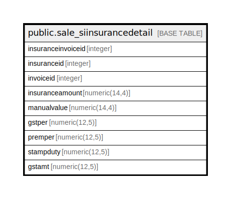

# public.sale_siinsurancedetail

## Description

## Columns

| Name | Type | Default | Nullable | Children | Parents | Comment |
| ---- | ---- | ------- | -------- | -------- | ------- | ------- |
| insuranceinvoiceid | integer | nextval('sale_siinsurancedetail_insuranceinvoiceid_seq'::regclass) | false |  |  |  |
| insuranceid | integer |  | true |  |  |  |
| invoiceid | integer |  | true |  |  |  |
| insuranceamount | numeric(14,4) |  | true |  |  |  |
| manualvalue | numeric(14,4) | 1 | true |  |  |  |
| gstper | numeric(12,5) |  | true |  |  |  |
| premper | numeric(12,5) |  | true |  |  |  |
| stampduty | numeric(12,5) |  | true |  |  |  |
| gstamt | numeric(12,5) |  | true |  |  |  |

## Constraints

| Name | Type | Definition |
| ---- | ---- | ---------- |
| sale_siinsurancedetail_pkey | PRIMARY KEY | PRIMARY KEY (insuranceinvoiceid) |

## Indexes

| Name | Definition |
| ---- | ---------- |
| sale_siinsurancedetail_pkey | CREATE UNIQUE INDEX sale_siinsurancedetail_pkey ON public.sale_siinsurancedetail USING btree (insuranceinvoiceid) |

## Relations

---

> Generated by [tbls](https://github.com/k1LoW/tbls)
