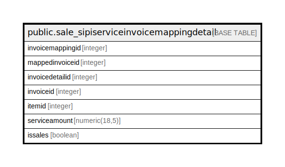

# public.sale_sipiserviceinvoicemappingdetail

## Description

## Columns

| Name | Type | Default | Nullable | Children | Parents | Comment |
| ---- | ---- | ------- | -------- | -------- | ------- | ------- |
| invoicemappingid | integer | nextval('sale_sipiserviceinvoicemappingdetail_invoicemappingid_seq'::regclass) | false |  |  |  |
| mappedinvoiceid | integer |  | true |  |  |  |
| invoicedetailid | integer |  | true |  |  |  |
| invoiceid | integer |  | true |  |  |  |
| itemid | integer |  | true |  |  |  |
| serviceamount | numeric(18,5) |  | true |  |  |  |
| issales | boolean | false | true |  |  |  |

## Relations

---

> Generated by [tbls](https://github.com/k1LoW/tbls)
