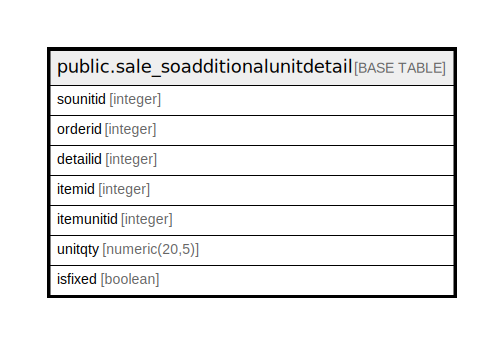

# public.sale_soadditionalunitdetail

## Description

## Columns

| Name | Type | Default | Nullable | Children | Parents | Comment |
| ---- | ---- | ------- | -------- | -------- | ------- | ------- |
| sounitid | integer | nextval('sale_soadditionalunitdetail_sounitid_seq'::regclass) | false |  |  |  |
| orderid | integer |  | true |  |  |  |
| detailid | integer |  | true |  |  |  |
| itemid | integer |  | true |  |  |  |
| itemunitid | integer |  | true |  |  |  |
| unitqty | numeric(20,5) |  | true |  |  |  |
| isfixed | boolean | false | true |  |  |  |

## Constraints

| Name | Type | Definition |
| ---- | ---- | ---------- |
| sale_soadditionalunitdetail_pkey | PRIMARY KEY | PRIMARY KEY (sounitid) |

## Indexes

| Name | Definition |
| ---- | ---------- |
| sale_soadditionalunitdetail_pkey | CREATE UNIQUE INDEX sale_soadditionalunitdetail_pkey ON public.sale_soadditionalunitdetail USING btree (sounitid) |
| Index_SO_AdiDet_DetID | CREATE INDEX "Index_SO_AdiDet_DetID" ON public.sale_soadditionalunitdetail USING btree (detailid) |
| Index_SO_AdiDet_SOIDDetID | CREATE INDEX "Index_SO_AdiDet_SOIDDetID" ON public.sale_soadditionalunitdetail USING btree (orderid, detailid) |

## Relations

---

> Generated by [tbls](https://github.com/k1LoW/tbls)
