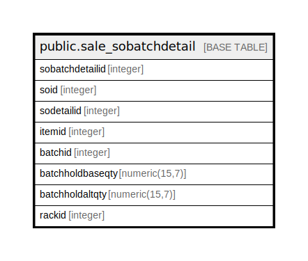

# public.sale_sobatchdetail

## Description

## Columns

| Name | Type | Default | Nullable | Children | Parents | Comment |
| ---- | ---- | ------- | -------- | -------- | ------- | ------- |
| sobatchdetailid | integer | nextval('sale_sobatchdetail_sobatchdetailid_seq'::regclass) | false |  |  |  |
| soid | integer |  | true |  |  |  |
| sodetailid | integer |  | true |  |  |  |
| itemid | integer |  | true |  |  |  |
| batchid | integer |  | true |  |  |  |
| batchholdbaseqty | numeric(15,7) |  | true |  |  |  |
| batchholdaltqty | numeric(15,7) |  | true |  |  |  |
| rackid | integer | 0 | true |  |  |  |

## Constraints

| Name | Type | Definition |
| ---- | ---- | ---------- |
| sale_sobatchdetail_pkey | PRIMARY KEY | PRIMARY KEY (sobatchdetailid) |

## Indexes

| Name | Definition |
| ---- | ---------- |
| sale_sobatchdetail_pkey | CREATE UNIQUE INDEX sale_sobatchdetail_pkey ON public.sale_sobatchdetail USING btree (sobatchdetailid) |

## Triggers

| Name | Definition |
| ---- | ---------- |
| sale_sobatchdetail_checkbatchstock | CREATE TRIGGER sale_sobatchdetail_checkbatchstock BEFORE INSERT OR UPDATE ON public.sale_sobatchdetail FOR EACH ROW EXECUTE FUNCTION trg_checkstock() |

## Relations

---

> Generated by [tbls](https://github.com/k1LoW/tbls)
