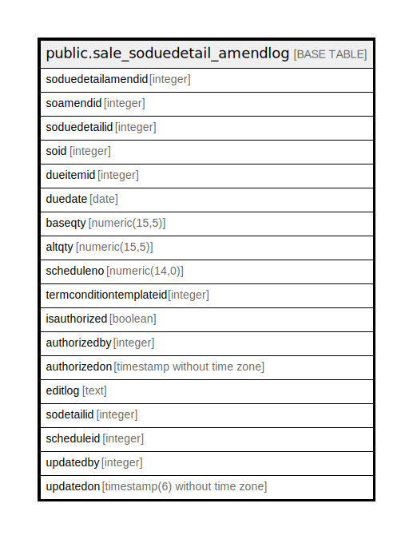

# public.sale_soduedetail_amendlog

## Description

## Columns

| Name | Type | Default | Nullable | Children | Parents | Comment |
| ---- | ---- | ------- | -------- | -------- | ------- | ------- |
| soduedetailamendid | integer | nextval('sale_soduedetail_amendlog_soduedetailamendid_seq'::regclass) | false |  |  |  |
| soamendid | integer |  | true |  |  |  |
| soduedetailid | integer | nextval('sale_soduedetail_amendlog_soduedetailid_seq'::regclass) | false |  |  |  |
| soid | integer |  | true |  |  |  |
| dueitemid | integer |  | true |  |  |  |
| duedate | date |  | true |  |  |  |
| baseqty | numeric(15,5) |  | true |  |  |  |
| altqty | numeric(15,5) |  | true |  |  |  |
| scheduleno | numeric(14,0) | NULL::numeric | true |  |  |  |
| termconditiontemplateid | integer |  | true |  |  |  |
| isauthorized | boolean | true | true |  |  |  |
| authorizedby | integer |  | true |  |  |  |
| authorizedon | timestamp without time zone |  | true |  |  |  |
| editlog | text |  | true |  |  |  |
| sodetailid | integer |  | true |  |  |  |
| scheduleid | integer |  | true |  |  |  |
| updatedby | integer |  | true |  |  |  |
| updatedon | timestamp(6) without time zone | NULL::timestamp without time zone | true |  |  |  |

## Constraints

| Name | Type | Definition |
| ---- | ---- | ---------- |
| sale_soduedetail_amendlog_pkey | PRIMARY KEY | PRIMARY KEY (soduedetailamendid) |

## Indexes

| Name | Definition |
| ---- | ---------- |
| sale_soduedetail_amendlog_pkey | CREATE UNIQUE INDEX sale_soduedetail_amendlog_pkey ON public.sale_soduedetail_amendlog USING btree (soduedetailamendid) |

## Relations

---

> Generated by [tbls](https://github.com/k1LoW/tbls)
