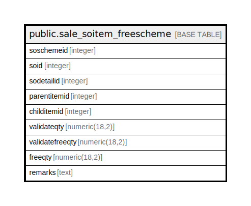

# public.sale_soitem_freescheme

## Description

## Columns

| Name | Type | Default | Nullable | Children | Parents | Comment |
| ---- | ---- | ------- | -------- | -------- | ------- | ------- |
| soschemeid | integer | nextval('sale_soitem_freescheme_soschemeid_seq'::regclass) | false |  |  |  |
| soid | integer |  | true |  |  |  |
| sodetailid | integer |  | true |  |  |  |
| parentitemid | integer |  | true |  |  |  |
| childitemid | integer |  | true |  |  |  |
| validateqty | numeric(18,2) |  | true |  |  |  |
| validatefreeqty | numeric(18,2) |  | true |  |  |  |
| freeqty | numeric(18,2) |  | true |  |  |  |
| remarks | text |  | true |  |  |  |

## Constraints

| Name | Type | Definition |
| ---- | ---- | ---------- |
| sale_soitem_freescheme_pkey | PRIMARY KEY | PRIMARY KEY (soschemeid) |

## Indexes

| Name | Definition |
| ---- | ---------- |
| sale_soitem_freescheme_pkey | CREATE UNIQUE INDEX sale_soitem_freescheme_pkey ON public.sale_soitem_freescheme USING btree (soschemeid) |

## Relations

---

> Generated by [tbls](https://github.com/k1LoW/tbls)
