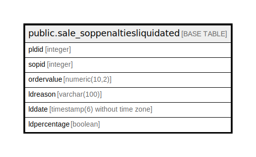

# public.sale_soppenaltiesliquidated

## Description

## Columns

| Name | Type | Default | Nullable | Children | Parents | Comment |
| ---- | ---- | ------- | -------- | -------- | ------- | ------- |
| pldid | integer | nextval('sale_soppenaltiesliquidated_pldid_seq'::regclass) | false |  |  |  |
| sopid | integer |  | true |  |  |  |
| ordervalue | numeric(10,2) |  | true |  |  |  |
| ldreason | varchar(100) |  | true |  |  |  |
| lddate | timestamp(6) without time zone |  | true |  |  |  |
| ldpercentage | boolean | false | true |  |  |  |

## Constraints

| Name | Type | Definition |
| ---- | ---- | ---------- |
| soppenaltiesliquidated_key | PRIMARY KEY | PRIMARY KEY (pldid) |

## Indexes

| Name | Definition |
| ---- | ---------- |
| soppenaltiesliquidated_key | CREATE UNIQUE INDEX soppenaltiesliquidated_key ON public.sale_soppenaltiesliquidated USING btree (pldid) |

## Relations

---

> Generated by [tbls](https://github.com/k1LoW/tbls)
