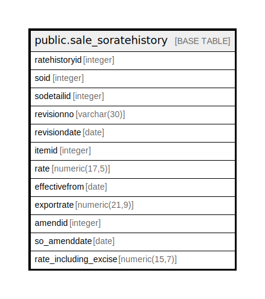

# public.sale_soratehistory

## Description

## Columns

| Name | Type | Default | Nullable | Children | Parents | Comment |
| ---- | ---- | ------- | -------- | -------- | ------- | ------- |
| ratehistoryid | integer | nextval('sale_soratehistory_ratehistoryid_seq'::regclass) | false |  |  |  |
| soid | integer |  | true |  |  |  |
| sodetailid | integer |  | true |  |  |  |
| revisionno | varchar(30) |  | true |  |  |  |
| revisiondate | date |  | true |  |  |  |
| itemid | integer |  | true |  |  |  |
| rate | numeric(17,5) |  | true |  |  |  |
| effectivefrom | date |  | true |  |  |  |
| exportrate | numeric(21,9) |  | true |  |  |  |
| amendid | integer |  | true |  |  |  |
| so_amenddate | date |  | true |  |  |  |
| rate_including_excise | numeric(15,7) | 0 | true |  |  |  |

## Constraints

| Name | Type | Definition |
| ---- | ---- | ---------- |
| sale_soratehistory_pkey | PRIMARY KEY | PRIMARY KEY (ratehistoryid) |

## Indexes

| Name | Definition |
| ---- | ---------- |
| sale_soratehistory_pkey | CREATE UNIQUE INDEX sale_soratehistory_pkey ON public.sale_soratehistory USING btree (ratehistoryid) |

## Relations

---

> Generated by [tbls](https://github.com/k1LoW/tbls)
