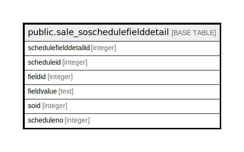

# public.sale_soschedulefielddetail

## Description

## Columns

| Name | Type | Default | Nullable | Children | Parents | Comment |
| ---- | ---- | ------- | -------- | -------- | ------- | ------- |
| schedulefielddetailid | integer | nextval('sale_soschedulefielddetail_schedulefielddetailid_seq'::regclass) | false |  |  |  |
| scheduleid | integer |  | true |  |  |  |
| fieldid | integer |  | true |  |  |  |
| fieldvalue | text |  | true |  |  |  |
| soid | integer |  | true |  |  |  |
| scheduleno | integer |  | true |  |  |  |

## Constraints

| Name | Type | Definition |
| ---- | ---- | ---------- |
| sale_soschedulefielddetail_pkey | PRIMARY KEY | PRIMARY KEY (schedulefielddetailid) |

## Indexes

| Name | Definition |
| ---- | ---------- |
| sale_soschedulefielddetail_pkey | CREATE UNIQUE INDEX sale_soschedulefielddetail_pkey ON public.sale_soschedulefielddetail USING btree (schedulefielddetailid) |

## Relations

---

> Generated by [tbls](https://github.com/k1LoW/tbls)
