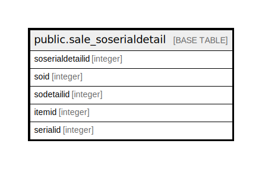

# public.sale_soserialdetail

## Description

## Columns

| Name | Type | Default | Nullable | Children | Parents | Comment |
| ---- | ---- | ------- | -------- | -------- | ------- | ------- |
| soserialdetailid | integer | nextval('sale_soserialdetail_soserialdetailid_seq'::regclass) | false |  |  |  |
| soid | integer |  | true |  |  |  |
| sodetailid | integer |  | true |  |  |  |
| itemid | integer |  | true |  |  |  |
| serialid | integer |  | true |  |  |  |

## Constraints

| Name | Type | Definition |
| ---- | ---- | ---------- |
| sale_soserialdetail_pkey | PRIMARY KEY | PRIMARY KEY (soserialdetailid) |

## Indexes

| Name | Definition |
| ---- | ---------- |
| sale_soserialdetail_pkey | CREATE UNIQUE INDEX sale_soserialdetail_pkey ON public.sale_soserialdetail USING btree (soserialdetailid) |
| Index_SO_SerDet_SOID | CREATE INDEX "Index_SO_SerDet_SOID" ON public.sale_soserialdetail USING btree (sodetailid) |
| Index_SO_SerDet_SOIDDetID | CREATE INDEX "Index_SO_SerDet_SOIDDetID" ON public.sale_soserialdetail USING btree (soid, sodetailid) |

## Relations

---

> Generated by [tbls](https://github.com/k1LoW/tbls)
