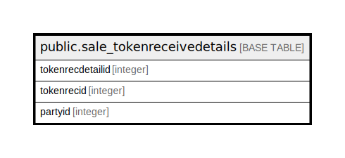

# public.sale_tokenreceivedetails

## Description

## Columns

| Name | Type | Default | Nullable | Children | Parents | Comment |
| ---- | ---- | ------- | -------- | -------- | ------- | ------- |
| tokenrecdetailid | integer | nextval('sale_tokenreceivedetails_tokenrecdetailid_seq'::regclass) | false |  |  |  |
| tokenrecid | integer |  | true |  |  |  |
| partyid | integer |  | true |  |  |  |
| token_520 | numeric(18,5) | 0 | true |  |  |  |
| token_521 | numeric(18,5) | 0 | true |  |  |  |
| token_522 | numeric(18,5) | 0 | true |  |  |  |
| token_523 | numeric(18,5) | 0 | true |  |  |  |
| token_524 | numeric(18,5) | 0 | true |  |  |  |
| token_525 | numeric(18,5) | 0 | true |  |  |  |
| token_526 | numeric(18,5) | 0 | true |  |  |  |
| token_527 | numeric(18,5) | 0 | true |  |  |  |
| token_528 | numeric(18,5) | 0 | true |  |  |  |
| token_529 | numeric(18,5) | 0 | true |  |  |  |
| token_530 | numeric(18,5) | 0 | true |  |  |  |
| token_826 | numeric(18,5) | 0 | true |  |  |  |
| token_827 | numeric(18,5) | 0 | true |  |  |  |
| token_828 | numeric(18,5) | 0 | true |  |  |  |
| token_829 | numeric(18,5) | 0 | true |  |  |  |
| token_831 | numeric(18,5) | 0 | true |  |  |  |
| token_830 | numeric(18,5) | 0 | true |  |  |  |
| token_832 | numeric(18,5) | 0 | true |  |  |  |
| token_833 | numeric(18,5) | 0 | true |  |  |  |
| token_824 | numeric(18,5) | 0 | true |  |  |  |
| token_823 | numeric(18,5) | 0 | true |  |  |  |
| token_825 | numeric(18,5) | 0 | true |  |  |  |
| chno | varchar(200) |  | true |  |  |  |
| totalamount | numeric(18,5) |  | true |  |  |  |
| handlingchrg | numeric(18,5) |  | true |  |  |  |
| netamount | numeric(18,5) |  | true |  |  |  |

## Constraints

| Name | Type | Definition |
| ---- | ---- | ---------- |
| sale_tokenreceivedetails_pkey | PRIMARY KEY | PRIMARY KEY (tokenrecdetailid) |

## Indexes

| Name | Definition |
| ---- | ---------- |
| sale_tokenreceivedetails_pkey | CREATE UNIQUE INDEX sale_tokenreceivedetails_pkey ON public.sale_tokenreceivedetails USING btree (tokenrecdetailid) |

## Relations

---

> Generated by [tbls](https://github.com/k1LoW/tbls)
