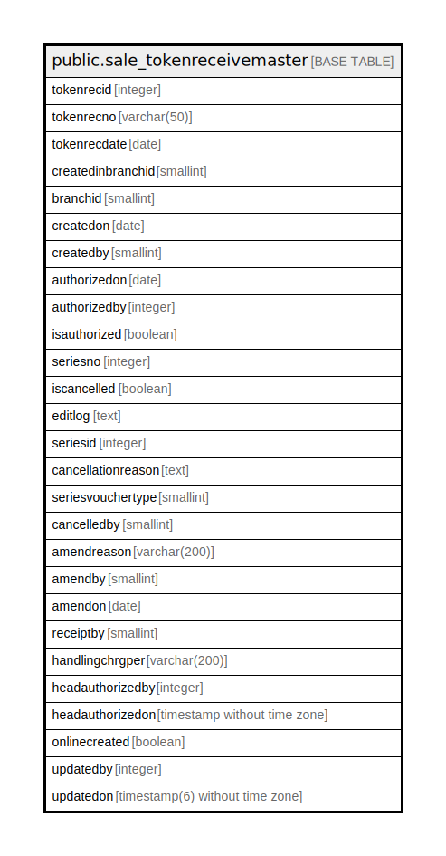

# public.sale_tokenreceivemaster

## Description

## Columns

| Name | Type | Default | Nullable | Children | Parents | Comment |
| ---- | ---- | ------- | -------- | -------- | ------- | ------- |
| tokenrecid | integer | nextval('sale_tokenreceivemaster_tokenrecid_seq'::regclass) | false |  |  |  |
| tokenrecno | varchar(50) |  | false |  |  |  |
| tokenrecdate | date |  | false |  |  |  |
| createdinbranchid | smallint |  | false |  |  |  |
| branchid | smallint |  | false |  |  |  |
| createdon | date |  | true |  |  |  |
| createdby | smallint |  | true |  |  |  |
| authorizedon | date |  | true |  |  |  |
| authorizedby | integer |  | true |  |  |  |
| isauthorized | boolean | false | true |  |  |  |
| seriesno | integer |  | true |  |  |  |
| iscancelled | boolean | false | true |  |  |  |
| editlog | text |  | true |  |  |  |
| seriesid | integer |  | true |  |  |  |
| cancellationreason | text |  | true |  |  |  |
| seriesvouchertype | smallint | 0 | true |  |  |  |
| cancelledby | smallint |  | true |  |  |  |
| amendreason | varchar(200) |  | true |  |  |  |
| amendby | smallint |  | true |  |  |  |
| amendon | date |  | true |  |  |  |
| receiptby | smallint |  | true |  |  |  |
| handlingchrgper | varchar(200) |  | true |  |  |  |
| headauthorizedby | integer |  | true |  |  |  |
| headauthorizedon | timestamp without time zone |  | true |  |  |  |
| onlinecreated | boolean | false | true |  |  |  |
| updatedby | integer |  | true |  |  |  |
| updatedon | timestamp(6) without time zone | NULL::timestamp without time zone | true |  |  |  |

## Constraints

| Name | Type | Definition |
| ---- | ---- | ---------- |
| sale_tokenreceivemaster_pkey | PRIMARY KEY | PRIMARY KEY (tokenrecid) |

## Indexes

| Name | Definition |
| ---- | ---------- |
| sale_tokenreceivemaster_pkey | CREATE UNIQUE INDEX sale_tokenreceivemaster_pkey ON public.sale_tokenreceivemaster USING btree (tokenrecid) |

## Relations

---

> Generated by [tbls](https://github.com/k1LoW/tbls)
