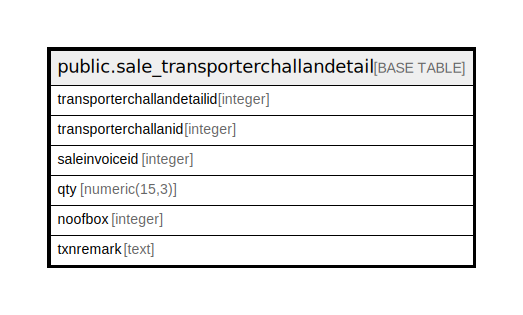

# public.sale_transporterchallandetail

## Description

## Columns

| Name | Type | Default | Nullable | Children | Parents | Comment |
| ---- | ---- | ------- | -------- | -------- | ------- | ------- |
| transporterchallandetailid | integer | nextval('sale_transporterchallandetail_transporterchallandetailid_seq'::regclass) | false |  |  |  |
| transporterchallanid | integer |  | true |  |  |  |
| saleinvoiceid | integer |  | true |  |  |  |
| qty | numeric(15,3) |  | true |  |  |  |
| noofbox | integer |  | true |  |  |  |
| txnremark | text |  | true |  |  |  |

## Constraints

| Name | Type | Definition |
| ---- | ---- | ---------- |
| sale_transporterchallandetail_pkey | PRIMARY KEY | PRIMARY KEY (transporterchallandetailid) |

## Indexes

| Name | Definition |
| ---- | ---------- |
| sale_transporterchallandetail_pkey | CREATE UNIQUE INDEX sale_transporterchallandetail_pkey ON public.sale_transporterchallandetail USING btree (transporterchallandetailid) |
| Index_TC_Det_TCID | CREATE INDEX "Index_TC_Det_TCID" ON public.sale_transporterchallandetail USING btree (transporterchallanid) |

## Relations

---

> Generated by [tbls](https://github.com/k1LoW/tbls)
