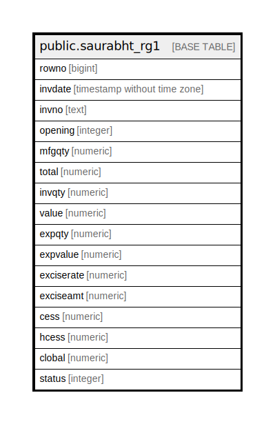

# public.saurabht_rg1

## Description

## Columns

| Name | Type | Default | Nullable | Children | Parents | Comment |
| ---- | ---- | ------- | -------- | -------- | ------- | ------- |
| rowno | bigint |  | true |  |  |  |
| invdate | timestamp without time zone |  | true |  |  |  |
| invno | text |  | true |  |  |  |
| opening | integer |  | true |  |  |  |
| mfgqty | numeric |  | true |  |  |  |
| total | numeric |  | true |  |  |  |
| invqty | numeric |  | true |  |  |  |
| value | numeric |  | true |  |  |  |
| expqty | numeric |  | true |  |  |  |
| expvalue | numeric |  | true |  |  |  |
| exciserate | numeric |  | true |  |  |  |
| exciseamt | numeric |  | true |  |  |  |
| cess | numeric |  | true |  |  |  |
| hcess | numeric |  | true |  |  |  |
| clobal | numeric |  | true |  |  |  |
| status | integer |  | true |  |  |  |

## Relations

---

> Generated by [tbls](https://github.com/k1LoW/tbls)
