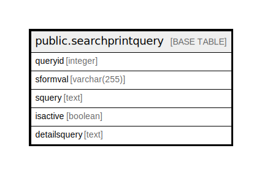

# public.searchprintquery

## Description

## Columns

| Name | Type | Default | Nullable | Children | Parents | Comment |
| ---- | ---- | ------- | -------- | -------- | ------- | ------- |
| queryid | integer |  | false |  |  |  |
| sformval | varchar(255) |  | true |  |  |  |
| squery | text |  | true |  |  |  |
| isactive | boolean |  | true |  |  |  |
| detailsquery | text |  | true |  |  |  |

## Constraints

| Name | Type | Definition |
| ---- | ---- | ---------- |
| SearchPrintQuery_pkey | PRIMARY KEY | PRIMARY KEY (queryid) |

## Indexes

| Name | Definition |
| ---- | ---------- |
| SearchPrintQuery_pkey | CREATE UNIQUE INDEX "SearchPrintQuery_pkey" ON public.searchprintquery USING btree (queryid) |

## Relations

---

> Generated by [tbls](https://github.com/k1LoW/tbls)
