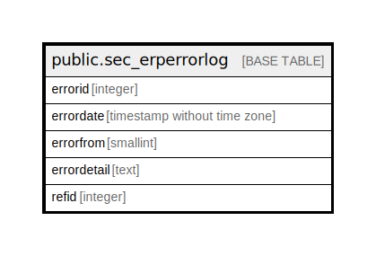

# public.sec_erperrorlog

## Description

## Columns

| Name | Type | Default | Nullable | Children | Parents | Comment |
| ---- | ---- | ------- | -------- | -------- | ------- | ------- |
| errorid | integer | nextval('sec_erperrorlog_errorid_seq'::regclass) | false |  |  |  |
| errordate | timestamp without time zone |  | true |  |  |  |
| errorfrom | smallint |  | true |  |  | 0- On Challan Auto PurchaseInvoice |
| errordetail | text |  | true |  |  |  |
| refid | integer |  | true |  |  |  |

## Constraints

| Name | Type | Definition |
| ---- | ---- | ---------- |
| sec_erperrorlog_pkey | PRIMARY KEY | PRIMARY KEY (errorid) |

## Indexes

| Name | Definition |
| ---- | ---------- |
| sec_erperrorlog_pkey | CREATE UNIQUE INDEX sec_erperrorlog_pkey ON public.sec_erperrorlog USING btree (errorid) |

## Relations

---

> Generated by [tbls](https://github.com/k1LoW/tbls)
