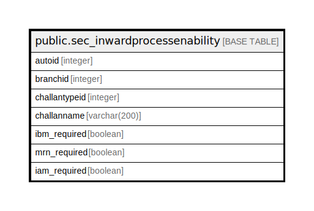

# public.sec_inwardprocessenability

## Description

## Columns

| Name | Type | Default | Nullable | Children | Parents | Comment |
| ---- | ---- | ------- | -------- | -------- | ------- | ------- |
| autoid | integer | nextval('sec_inwardprocessenability_autoid_seq'::regclass) | false |  |  |  |
| branchid | integer |  | true |  |  |  |
| challantypeid | integer |  | true |  |  |  |
| challanname | varchar(200) |  | true |  |  |  |
| ibm_required | boolean | true | true |  |  |  |
| mrn_required | boolean | true | true |  |  |  |
| iam_required | boolean | true | true |  |  |  |

## Constraints

| Name | Type | Definition |
| ---- | ---- | ---------- |
| sec_inwardprocessenability_pkey | PRIMARY KEY | PRIMARY KEY (autoid) |

## Indexes

| Name | Definition |
| ---- | ---------- |
| sec_inwardprocessenability_pkey | CREATE UNIQUE INDEX sec_inwardprocessenability_pkey ON public.sec_inwardprocessenability USING btree (autoid) |

## Relations

---

> Generated by [tbls](https://github.com/k1LoW/tbls)
