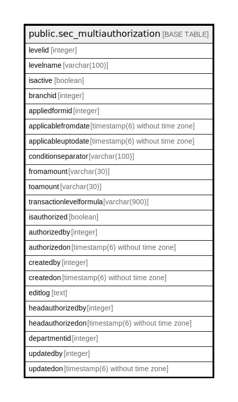

# public.sec_multiauthorization

## Description

## Columns

| Name | Type | Default | Nullable | Children | Parents | Comment |
| ---- | ---- | ------- | -------- | -------- | ------- | ------- |
| levelid | integer | nextval('sec_multiauthorization_levelid_seq'::regclass) | false |  |  |  |
| levelname | varchar(100) |  | true |  |  |  |
| isactive | boolean | false | true |  |  |  |
| branchid | integer |  | true |  |  |  |
| appliedformid | integer |  | true |  |  |  |
| applicablefromdate | timestamp(6) without time zone |  | true |  |  |  |
| applicableuptodate | timestamp(6) without time zone |  | true |  |  |  |
| conditionseparator | varchar(100) |  | true |  |  |  |
| fromamount | varchar(30) |  | true |  |  |  |
| toamount | varchar(30) |  | true |  |  |  |
| transactionlevelformula | varchar(900) |  | true |  |  |  |
| isauthorized | boolean | false | true |  |  |  |
| authorizedby | integer |  | true |  |  |  |
| authorizedon | timestamp(6) without time zone |  | true |  |  |  |
| createdby | integer |  | true |  |  |  |
| createdon | timestamp(6) without time zone | now() | true |  |  |  |
| editlog | text |  | true |  |  |  |
| headauthorizedby | integer |  | true |  |  |  |
| headauthorizedon | timestamp(6) without time zone |  | true |  |  |  |
| departmentid | integer |  | true |  |  |  |
| updatedby | integer |  | true |  |  |  |
| updatedon | timestamp(6) without time zone | NULL::timestamp without time zone | true |  |  |  |

## Constraints

| Name | Type | Definition |
| ---- | ---- | ---------- |
| sec_multiauthorization_levelname_key | UNIQUE | UNIQUE (levelname) |
| sec_multiauthorization_pkey | PRIMARY KEY | PRIMARY KEY (levelid) |

## Indexes

| Name | Definition |
| ---- | ---------- |
| sec_multiauthorization_levelname_key | CREATE UNIQUE INDEX sec_multiauthorization_levelname_key ON public.sec_multiauthorization USING btree (levelname) |
| sec_multiauthorization_pkey | CREATE UNIQUE INDEX sec_multiauthorization_pkey ON public.sec_multiauthorization USING btree (levelid) |

## Relations

---

> Generated by [tbls](https://github.com/k1LoW/tbls)
