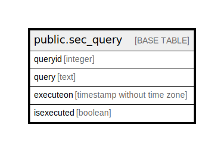

# public.sec_query

## Description

## Columns

| Name | Type | Default | Nullable | Children | Parents | Comment |
| ---- | ---- | ------- | -------- | -------- | ------- | ------- |
| queryid | integer | nextval('sec_query_queryid_seq'::regclass) | false |  |  |  |
| query | text |  | true |  |  |  |
| executeon | timestamp without time zone |  | true |  |  |  |
| isexecuted | boolean | false | true |  |  |  |

## Constraints

| Name | Type | Definition |
| ---- | ---- | ---------- |
| sec_query_pkey | PRIMARY KEY | PRIMARY KEY (queryid) |

## Indexes

| Name | Definition |
| ---- | ---------- |
| sec_query_pkey | CREATE UNIQUE INDEX sec_query_pkey ON public.sec_query USING btree (queryid) |

## Relations

---

> Generated by [tbls](https://github.com/k1LoW/tbls)
