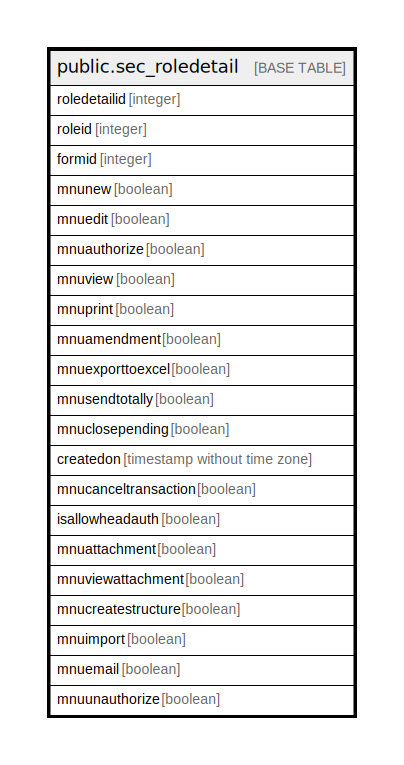

# public.sec_roledetail

## Description

## Columns

| Name | Type | Default | Nullable | Children | Parents | Comment |
| ---- | ---- | ------- | -------- | -------- | ------- | ------- |
| roledetailid | integer | nextval('sec_roledetail_roledetailid_seq'::regclass) | false |  |  |  |
| roleid | integer |  | true |  |  |  |
| formid | integer |  | true |  |  |  |
| mnunew | boolean | false | true |  |  |  |
| mnuedit | boolean | false | true |  |  |  |
| mnuauthorize | boolean | false | true |  |  |  |
| mnuview | boolean | false | true |  |  |  |
| mnuprint | boolean | false | true |  |  |  |
| mnuamendment | boolean | false | true |  |  |  |
| mnuexporttoexcel | boolean | false | true |  |  |  |
| mnusendtotally | boolean | false | true |  |  |  |
| mnuclosepending | boolean | false | false |  |  |  |
| createdon | timestamp without time zone | now() | true |  |  |  |
| mnucanceltransaction | boolean | false | true |  |  |  |
| isallowheadauth | boolean | false | true |  |  |  |
| mnuattachment | boolean |  | true |  |  |  |
| mnuviewattachment | boolean |  | true |  |  |  |
| mnucreatestructure | boolean |  | true |  |  |  |
| mnuimport | boolean |  | true |  |  |  |
| mnuemail | boolean |  | true |  |  |  |
| mnuunauthorize | boolean |  | true |  |  |  |

## Constraints

| Name | Type | Definition |
| ---- | ---- | ---------- |
| roledetail_pkey | PRIMARY KEY | PRIMARY KEY (roledetailid) |
| sec_roledetailroleid_key | UNIQUE | UNIQUE (roleid, formid) |

## Indexes

| Name | Definition |
| ---- | ---------- |
| roledetail_pkey | CREATE UNIQUE INDEX roledetail_pkey ON public.sec_roledetail USING btree (roledetailid) |
| sec_roledetailroleid_key | CREATE UNIQUE INDEX sec_roledetailroleid_key ON public.sec_roledetail USING btree (roleid, formid) |

## Triggers

| Name | Definition |
| ---- | ---------- |
| tgr_sec_roledetail_editlog | CREATE TRIGGER tgr_sec_roledetail_editlog AFTER UPDATE ON public.sec_roledetail FOR EACH ROW EXECUTE FUNCTION tgr_sec_roledetail_editlog() |

## Relations

---

> Generated by [tbls](https://github.com/k1LoW/tbls)
