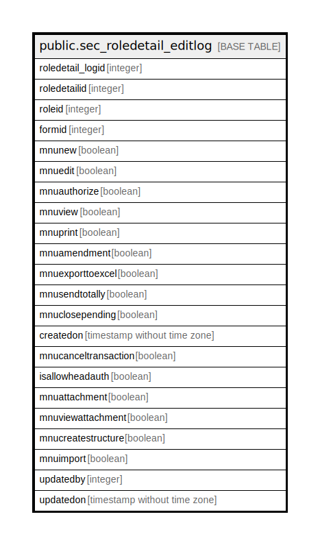

# public.sec_roledetail_editlog

## Description

## Columns

| Name | Type | Default | Nullable | Children | Parents | Comment |
| ---- | ---- | ------- | -------- | -------- | ------- | ------- |
| roledetail_logid | integer | nextval('sec_roledetail_editlog_roledetail_logid_seq'::regclass) | false |  |  |  |
| roledetailid | integer |  | true |  |  |  |
| roleid | integer |  | true |  |  |  |
| formid | integer |  | true |  |  |  |
| mnunew | boolean | false | true |  |  |  |
| mnuedit | boolean | false | true |  |  |  |
| mnuauthorize | boolean | false | true |  |  |  |
| mnuview | boolean | false | true |  |  |  |
| mnuprint | boolean | false | true |  |  |  |
| mnuamendment | boolean | false | true |  |  |  |
| mnuexporttoexcel | boolean | false | true |  |  |  |
| mnusendtotally | boolean | false | true |  |  |  |
| mnuclosepending | boolean | false | false |  |  |  |
| createdon | timestamp without time zone | now() | true |  |  |  |
| mnucanceltransaction | boolean | false | true |  |  |  |
| isallowheadauth | boolean | false | true |  |  |  |
| mnuattachment | boolean |  | true |  |  |  |
| mnuviewattachment | boolean |  | true |  |  |  |
| mnucreatestructure | boolean |  | true |  |  |  |
| mnuimport | boolean |  | true |  |  |  |
| updatedby | integer |  | true |  |  |  |
| updatedon | timestamp without time zone | now() | true |  |  |  |

## Constraints

| Name | Type | Definition |
| ---- | ---- | ---------- |
| sec_roledetail_editlog_pkey | PRIMARY KEY | PRIMARY KEY (roledetail_logid) |

## Indexes

| Name | Definition |
| ---- | ---------- |
| sec_roledetail_editlog_pkey | CREATE UNIQUE INDEX sec_roledetail_editlog_pkey ON public.sec_roledetail_editlog USING btree (roledetail_logid) |

## Relations

---

> Generated by [tbls](https://github.com/k1LoW/tbls)
