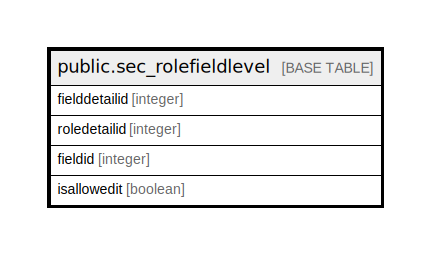

# public.sec_rolefieldlevel

## Description

## Columns

| Name | Type | Default | Nullable | Children | Parents | Comment |
| ---- | ---- | ------- | -------- | -------- | ------- | ------- |
| fielddetailid | integer | nextval('sec_rolefieldlevel_fielddetailid_seq'::regclass) | false |  |  |  |
| roledetailid | integer |  | true |  |  |  |
| fieldid | integer |  | true |  |  |  |
| isallowedit | boolean | false | true |  |  |  |

## Constraints

| Name | Type | Definition |
| ---- | ---- | ---------- |
| rolefieldlevel_pkey | PRIMARY KEY | PRIMARY KEY (fielddetailid) |

## Indexes

| Name | Definition |
| ---- | ---------- |
| rolefieldlevel_pkey | CREATE UNIQUE INDEX rolefieldlevel_pkey ON public.sec_rolefieldlevel USING btree (fielddetailid) |

## Relations

---

> Generated by [tbls](https://github.com/k1LoW/tbls)
