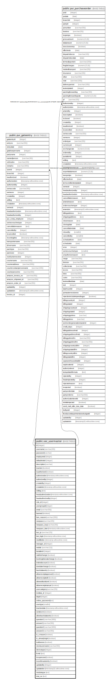

# public.sec_usermaster

## Description

## Columns

| Name | Type | Default | Nullable | Children | Parents | Comment |
| ---- | ---- | ------- | -------- | -------- | ------- | ------- |
| id | integer | nextval('sec_usermaster_userid_seq'::regclass) | false | [public.pur_gateentry](public.pur_gateentry.md) [public.pur_purchaseorder](public.pur_purchaseorder.md) |  |  |
| username | varchar(20) |  | false |  |  |  |
| password | varchar |  | false |  |  |  |
| employeeid | integer |  | true |  |  |  |
| defaultroleid | integer |  | true |  |  |  |
| description | varchar |  | true |  |  |  |
| isactive | boolean | true | false |  |  |  |
| isauthorized | boolean | false | false |  |  |  |
| authorizedon | timestamp without time zone |  | true |  |  |  |
| authorizedby | integer |  | true |  |  |  |
| createdby | integer |  | true |  |  |  |
| createdon | timestamp without time zone | now() | true |  |  |  |
| editlog | text |  | true |  |  |  |
| headauthorizedon | timestamp without time zone |  | true |  |  |  |
| headauthorizedby | integer |  | true |  |  |  |
| role_id | integer |  | true |  |  |  |
| usergroupid | integer |  | true |  |  |  |
| email | varchar(50) |  | true |  |  |  |
| banned | boolean | false | true |  |  |  |
| ban_reason | varchar(200) |  | true |  |  |  |
| newpass | varchar(20) |  | true |  |  |  |
| newpass_key | varchar(20) |  | true |  |  |  |
| newpass_time | timestamp without time zone |  | true |  |  |  |
| last_ip | varchar(15) |  | true |  |  |  |
| last_login | timestamp without time zone |  | true |  |  |  |
| modifiedon | timestamp without time zone |  | true |  |  |  |
| manager_id | integer |  | true |  |  |  |
| mobile | varchar(12) |  | true |  |  |  |
| lastalterid | integer |  | true |  |  |  |
| ratelistchange | boolean | false | true |  |  |  |
| bookingtimeratechange | boolean | false | true |  |  |  |
| entirediscount | boolean | false | true |  |  |  |
| duedatechange | boolean | false | true |  |  |  |
| backdateentry | boolean | false | true |  |  |  |
| allowreceiptapproval | boolean | false | true |  |  |  |
| allowreceiptedit | boolean | false | true |  |  |  |
| alloweditsoldunit | boolean | false | true |  |  |  |
| allowreceiptmanual | boolean | false | true |  |  |  |
| usercategory | varchar(20) |  | true |  |  |  |
| institute_id | integer |  | true |  |  |  |
| depid | integer |  | true |  |  |  |
| online_password | text |  | true |  |  |  |
| usertype | smallint | 3 | true |  |  |  |
| inactivedate | timestamp without time zone |  | true |  |  |  |
| sentincrm | boolean | false | true |  |  |  |
| allowbackdateentry | boolean | false | true |  |  |  |
| question1 | varchar(300) |  | true |  |  |  |
| answer1 | varchar(50) |  | true |  |  |  |
| question2 | varchar(300) |  | true |  |  |  |
| answer2 | varchar(50) |  | true |  |  |  |
| is_crmuser | boolean | false | true |  |  |  |
| is_alreadylogin | boolean | false | true |  |  | This field is created to prevent the user to log in to multiple instances with same username. |
| isallowoos | boolean |  | true |  |  |  |
| msmeusername | varchar(50) |  | true |  |  |  |
| devicetype | integer | 0 | true |  |  |  |
| fcmid | text |  | true |  |  |  |
| issuperuser | boolean | false | true |  |  |  |
| isuseforautoentry | boolean | false | true |  |  |  |
| updatedby | integer |  | true |  |  |  |
| updatedon | timestamp(6) without time zone | NULL::timestamp without time zone | true |  |  |  |
| moduletype | text |  | true |  |  |  |
| imei_no | text |  | true |  |  |  |

## Constraints

| Name | Type | Definition |
| ---- | ---- | ---------- |
| user_pkey | PRIMARY KEY | PRIMARY KEY (id) |
| user_username_key | UNIQUE | UNIQUE (username) |

## Indexes

| Name | Definition |
| ---- | ---------- |
| user_pkey | CREATE UNIQUE INDEX user_pkey ON public.sec_usermaster USING btree (id) |
| user_username_key | CREATE UNIQUE INDEX user_username_key ON public.sec_usermaster USING btree (username) |

## Relations

---

> Generated by [tbls](https://github.com/k1LoW/tbls)
