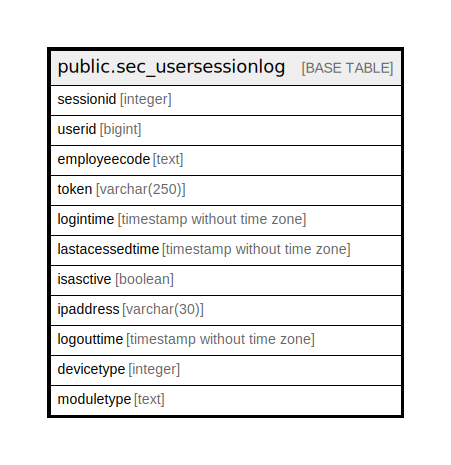

# public.sec_usersessionlog

## Description

## Columns

| Name | Type | Default | Nullable | Children | Parents | Comment |
| ---- | ---- | ------- | -------- | -------- | ------- | ------- |
| sessionid | integer | nextval('sec_usersessionlog_sessionid_seq'::regclass) | false |  |  |  |
| userid | bigint |  | false |  |  |  |
| employeecode | text |  | true |  |  |  |
| token | varchar(250) |  | false |  |  |  |
| logintime | timestamp without time zone |  | false |  |  |  |
| lastacessedtime | timestamp without time zone |  | false |  |  |  |
| isasctive | boolean |  | false |  |  |  |
| ipaddress | varchar(30) |  | true |  |  |  |
| logouttime | timestamp without time zone |  | true |  |  |  |
| devicetype | integer | 0 | true |  |  |  |
| moduletype | text |  | true |  |  |  |

## Relations

---

> Generated by [tbls](https://github.com/k1LoW/tbls)
