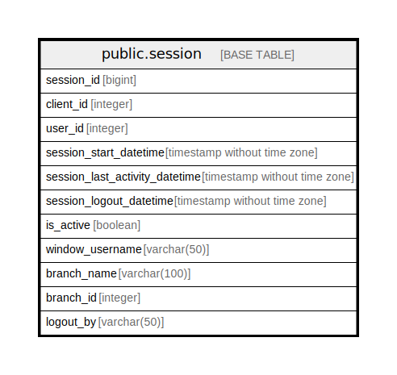

# public.session

## Description

## Columns

| Name | Type | Default | Nullable | Children | Parents | Comment |
| ---- | ---- | ------- | -------- | -------- | ------- | ------- |
| session_id | bigint | nextval('session_session_id_seq'::regclass) | false |  |  |  |
| client_id | integer |  | true |  |  |  |
| user_id | integer |  | true |  |  |  |
| session_start_datetime | timestamp without time zone | now() | true |  |  |  |
| session_last_activity_datetime | timestamp without time zone | now() | true |  |  |  |
| session_logout_datetime | timestamp without time zone |  | true |  |  |  |
| is_active | boolean | true | true |  |  |  |
| window_username | varchar(50) |  | true |  |  |  |
| branch_name | varchar(100) |  | true |  |  |  |
| branch_id | integer |  | true |  |  |  |
| logout_by | varchar(50) |  | true |  |  |  |

## Constraints

| Name | Type | Definition |
| ---- | ---- | ---------- |
| session_pkey | PRIMARY KEY | PRIMARY KEY (session_id) |

## Indexes

| Name | Definition |
| ---- | ---------- |
| session_pkey | CREATE UNIQUE INDEX session_pkey ON public.session USING btree (session_id) |

## Relations

---

> Generated by [tbls](https://github.com/k1LoW/tbls)
