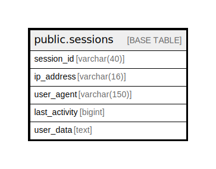

# public.sessions

## Description

## Columns

| Name | Type | Default | Nullable | Children | Parents | Comment |
| ---- | ---- | ------- | -------- | -------- | ------- | ------- |
| session_id | varchar(40) | '0'::character varying | false |  |  |  |
| ip_address | varchar(16) | '0'::character varying | false |  |  |  |
| user_agent | varchar(150) |  | false |  |  |  |
| last_activity | bigint | 0 | false |  |  |  |
| user_data | text |  | true |  |  |  |

## Constraints

| Name | Type | Definition |
| ---- | ---- | ---------- |
| sessions_pkey | PRIMARY KEY | PRIMARY KEY (session_id) |

## Indexes

| Name | Definition |
| ---- | ---------- |
| sessions_pkey | CREATE UNIQUE INDEX sessions_pkey ON public.sessions USING btree (session_id) |

## Relations

---

> Generated by [tbls](https://github.com/k1LoW/tbls)
