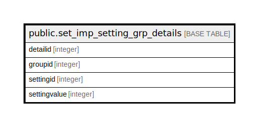

# public.set_imp_setting_grp_details

## Description

## Columns

| Name | Type | Default | Nullable | Children | Parents | Comment |
| ---- | ---- | ------- | -------- | -------- | ------- | ------- |
| detailid | integer | nextval('set_imp_setting_grp_details_detailid_seq'::regclass) | false |  |  |  |
| groupid | integer |  | false |  |  |  |
| settingid | integer |  | false |  |  |  |
| settingvalue | integer |  | true |  |  |  |

## Constraints

| Name | Type | Definition |
| ---- | ---- | ---------- |
| set_imp_setting_grp_details_pkey | PRIMARY KEY | PRIMARY KEY (detailid) |

## Indexes

| Name | Definition |
| ---- | ---------- |
| set_imp_setting_grp_details_pkey | CREATE UNIQUE INDEX set_imp_setting_grp_details_pkey ON public.set_imp_setting_grp_details USING btree (detailid) |

## Relations

---

> Generated by [tbls](https://github.com/k1LoW/tbls)
