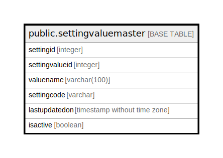

# public.settingvaluemaster

## Description

## Columns

| Name | Type | Default | Nullable | Children | Parents | Comment |
| ---- | ---- | ------- | -------- | -------- | ------- | ------- |
| settingid | integer |  | false |  |  |  |
| settingvalueid | integer |  | false |  |  |  |
| valuename | varchar(100) |  | true |  |  |  |
| settingcode | varchar |  | true |  |  |  |
| lastupdatedon | timestamp without time zone |  | true |  |  |  |
| isactive | boolean | true | false |  |  |  |

## Constraints

| Name | Type | Definition |
| ---- | ---- | ---------- |
| settingvaluemaster_pkey | PRIMARY KEY | PRIMARY KEY (settingid, settingvalueid) |

## Indexes

| Name | Definition |
| ---- | ---------- |
| settingvaluemaster_pkey | CREATE UNIQUE INDEX settingvaluemaster_pkey ON public.settingvaluemaster USING btree (settingid, settingvalueid) |

## Triggers

| Name | Definition |
| ---- | ---------- |
| trg_update_lastupdateon_settingvaluemaster | CREATE TRIGGER trg_update_lastupdateon_settingvaluemaster AFTER INSERT OR UPDATE OF valuename, settingcode ON public.settingvaluemaster FOR EACH ROW EXECUTE FUNCTION update_lastupdateon_settingvaluemaster() |

## Relations

---

> Generated by [tbls](https://github.com/k1LoW/tbls)
