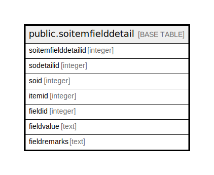

# public.soitemfielddetail

## Description

## Columns

| Name | Type | Default | Nullable | Children | Parents | Comment |
| ---- | ---- | ------- | -------- | -------- | ------- | ------- |
| soitemfielddetailid | integer | nextval('soitemfielddetail_soitemfielddetailid_seq'::regclass) | false |  |  |  |
| sodetailid | integer |  | true |  |  |  |
| soid | integer |  | true |  |  |  |
| itemid | integer |  | true |  |  |  |
| fieldid | integer |  | true |  |  |  |
| fieldvalue | text |  | true |  |  |  |
| fieldremarks | text | ''::text | true |  |  |  |

## Constraints

| Name | Type | Definition |
| ---- | ---- | ---------- |
| soitemfielddetail_pkey | PRIMARY KEY | PRIMARY KEY (soitemfielddetailid) |

## Indexes

| Name | Definition |
| ---- | ---------- |
| soitemfielddetail_pkey | CREATE UNIQUE INDEX soitemfielddetail_pkey ON public.soitemfielddetail USING btree (soitemfielddetailid) |

## Relations

---

> Generated by [tbls](https://github.com/k1LoW/tbls)
