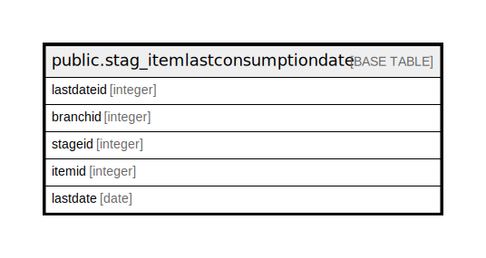

# public.stag_itemlastconsumptiondate

## Description

## Columns

| Name | Type | Default | Nullable | Children | Parents | Comment |
| ---- | ---- | ------- | -------- | -------- | ------- | ------- |
| lastdateid | integer | nextval('stag_itemlastconsumptiondate_lastdateid_seq'::regclass) | false |  |  |  |
| branchid | integer |  | true |  |  |  |
| stageid | integer |  | true |  |  |  |
| itemid | integer |  | true |  |  |  |
| lastdate | date |  | true |  |  |  |

## Constraints

| Name | Type | Definition |
| ---- | ---- | ---------- |
| stag_itemlastconsumptiondate_pkey | PRIMARY KEY | PRIMARY KEY (lastdateid) |

## Indexes

| Name | Definition |
| ---- | ---------- |
| stag_itemlastconsumptiondate_pkey | CREATE UNIQUE INDEX stag_itemlastconsumptiondate_pkey ON public.stag_itemlastconsumptiondate USING btree (lastdateid) |

## Relations

---

> Generated by [tbls](https://github.com/k1LoW/tbls)
