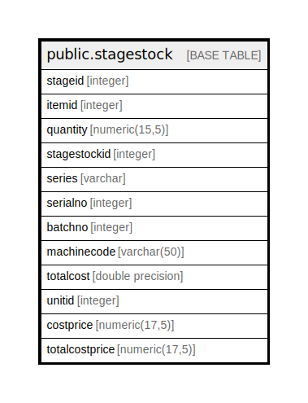

# public.stagestock

## Description

## Columns

| Name | Type | Default | Nullable | Children | Parents | Comment |
| ---- | ---- | ------- | -------- | -------- | ------- | ------- |
| stageid | integer |  | false |  |  |  |
| itemid | integer |  | false |  |  |  |
| quantity | numeric(15,5) | 0 | true |  |  |  |
| stagestockid | integer | nextval('stagestock_stagestockid_seq'::regclass) | false |  |  |  |
| series | varchar | 0 | true |  |  |  |
| serialno | integer | 0 | true |  |  |  |
| batchno | integer | 0 | true |  |  |  |
| machinecode | varchar(50) | ''::character varying | true |  |  |  |
| totalcost | double precision | 0 | true |  |  |  |
| unitid | integer |  | true |  |  |  |
| costprice | numeric(17,5) |  | true |  |  |  |
| totalcostprice | numeric(17,5) | 0 | true |  |  |  |

## Relations

---

> Generated by [tbls](https://github.com/k1LoW/tbls)
